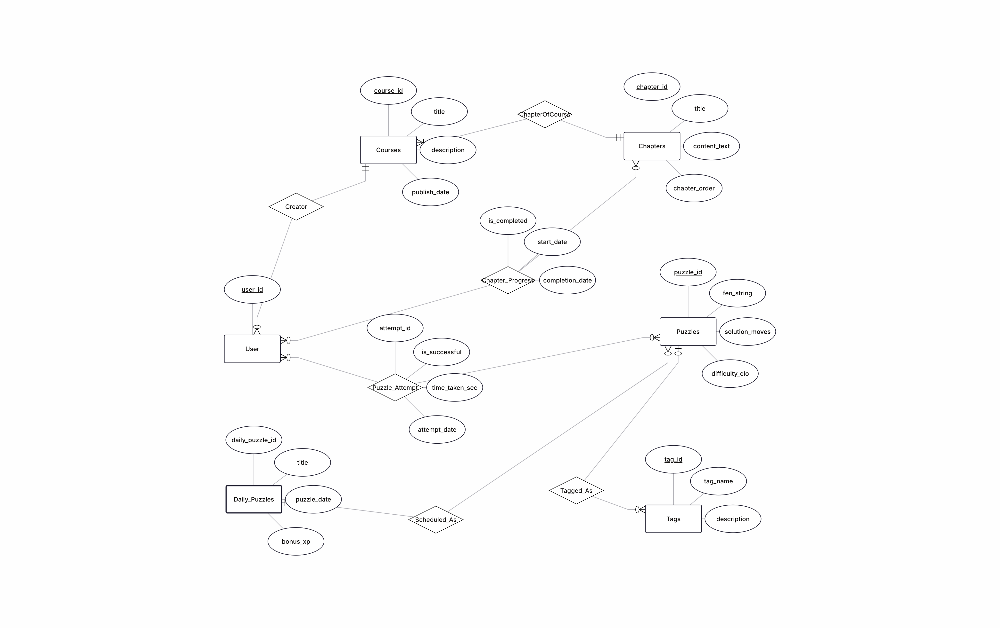
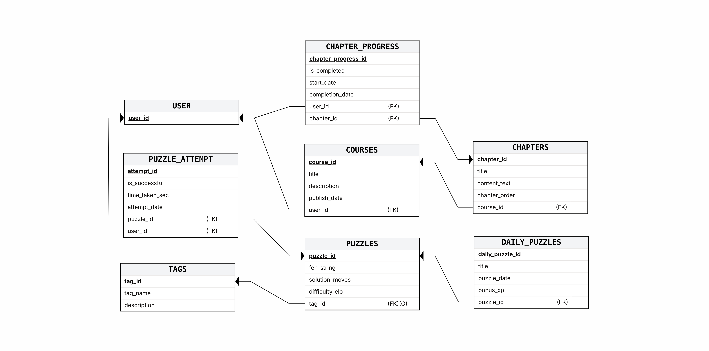
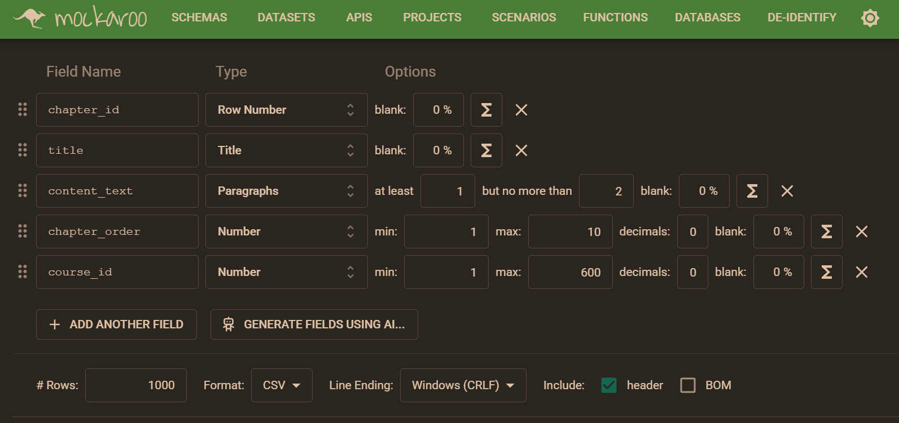
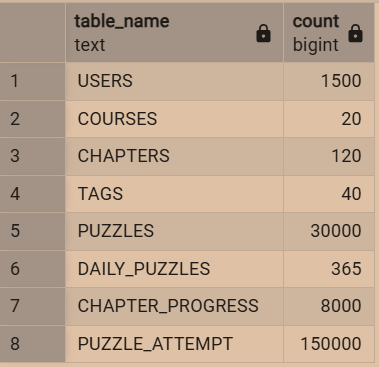
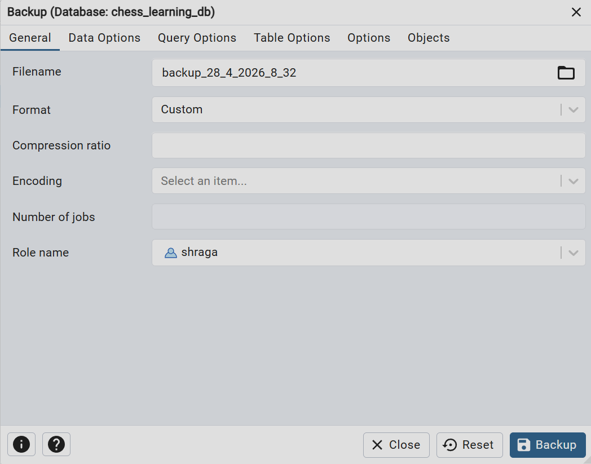
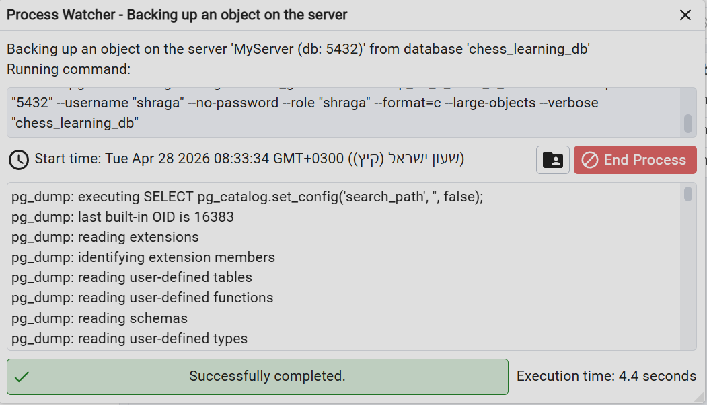
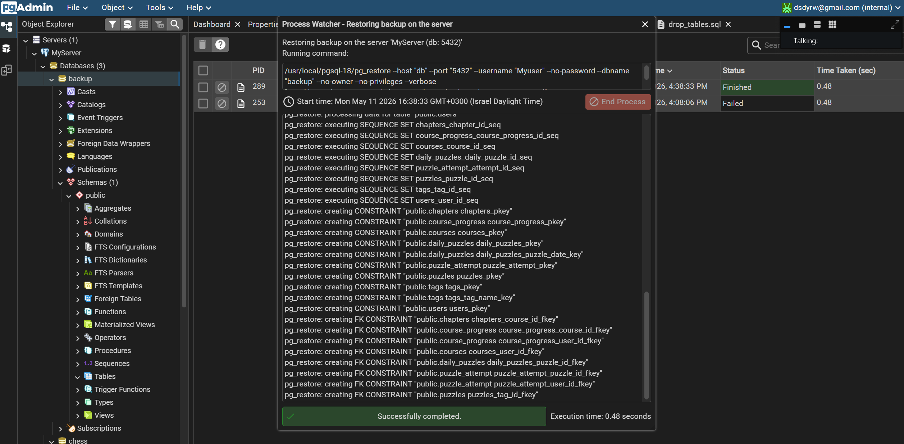

# Chess Learning & Puzzles Platform

Authors: Avraham Shaviro & Shraga Chesrak

## Table of Contents

- [Chess Learning \& Puzzles Platform](#chess-learning--puzzles-platform)
  - [Table of Contents](#table-of-contents)
  - [Phase 1: Design and Build the Database](#phase-1-design-and-build-the-database)
    - [Introduction](#introduction)
      - [Purpose of the Database](#purpose-of-the-database)
      - [Potential Use Cases](#potential-use-cases)
    - [ERD (Entity-Relationship Diagram)](#erd-entity-relationship-diagram)
    - [DSD (Data Structure Diagram)](#dsd-data-structure-diagram)
    - [SQL Scripts](#sql-scripts)
      - [First tool: using mockaro](#first-tool-using-mockaro)
      - [Second tool: using python script to create csv file from imported real data](#second-tool-using-python-script-to-create-csv-file-from-imported-real-data)
      - [Third tool: using python script to create csv file from imported real data](#third-tool-using-python-script-to-create-csv-file-from-imported-real-data)
      - [After running the `create_tables.sql`, `insert_tables.sql` and `count_all.sql` scripts, we can see the following result:](#after-running-the-create_tablessql-insert_tablessql-and-count_allsql-scripts-we-can-see-the-following-result)
    - [Backup](#backup)
      - [First Way: Using pgadmin interface:](#first-way-using-pgadmin-interface)
      - [Second Way: Using CLI:](#second-way-using-cli)
  - [Phase 2: Integration](#phase-2-integration)

## Phase 1: Design and Build the Database

### Introduction

The **Chess Learning & Puzzles Database** is designed to efficiently manage an educational platform where users can enroll in courses, read chapters, and solve chess puzzles. This system ensures smooth organization and tracking of user progress, course structures, puzzle difficulty, and daily challenges.

#### Purpose of the Database

This database serves as a structured and reliable solution for the platform to:

- **Manage courses and chapters**, allowing structured content delivery to users.
- **Store chess puzzles**, including FEN strings, solution moves, tags, and difficulty ratings (ELO).
- **Track user attempts**, recording success rates and time taken to solve puzzles.
- **Monitor course progress**, keeping track of when users start and complete specific courses.
- **Offer Daily Puzzles** with unique dates and bonus XP rewards for consistent engagement.

#### Potential Use Cases

- **Platform Administrators / Instructors** can use this database to create new courses, upload puzzles, and assign daily challenges.
- **Users (Students/Players)** can track their learning progress, review their puzzle-solving history, and see their course completion status.
- **System Analytics** can utilize the puzzle attempt records to adjust the difficulty ELO of puzzles based on how many users succeed or fail, and calculate the average time taken.

This structured database helps streamline the e-learning experience, improving content organization and user tracking.

### ERD (Entity-Relationship Diagram)

### DSD (Data Structure Diagram)

### SQL Scripts

Provide the following SQL scripts:

- **Create Tables Script** - The SQL script for creating the database tables is available in the repository:

📜 **[View `create_tables.sql`](phase1/scripts/create_tables.sql)**

- **Insert Data Script** - The SQL script for insert data to the database tables is available in the repository:

📜 **[View `insert_tables.sql`](phase1/scripts/insert_tables.sql)**

- **Drop Tables Script** - The SQL script for droping all tables is available in the repository:

📜 **[View `drop_tables.sql`](phase1/scripts/drop_tables.sql)**

- **Select All Data Script** - The SQL script for selectAll tables is available in the repository:

📜 **[View `select_all.sql`](phase1/scripts/select_all.sql)** 

- **Count All Data Script** - The SQL script for countAll tables is available in the repository:

📜 **[View `count_all.sql`](phase1/scripts/count_all.sql)** 

#### First tool: using [mockaro](https://www.mockaroo.com/)

📜 **[View `mockarooFiles`](phase1/mockarooFiles)** 

#### Second tool: using python script to create csv file from imported real data

📜 **[View `DAILY_PUZZLES.py`](phase1/programming/DAILY_PUZZLES.py)** 
📜 **[View `DAILY_PUZZLES.py`](phase1/programming/PUZZLE_ATTEMPT.py)** 

#### Third tool: using python script to create csv file from imported real data

📜 **[View `puzzles_and_tags.py`](phase1/programming/puzzles_and_tags.py)** 

####  After running the `create_tables.sql`, `insert_tables.sql` and `count_all.sql` scripts, we can see the following result:

### Backup

#### First Way: Using pgadmin interface:

<!--

-->

#### Second Way: Using CLI:

## Phase 2: Integration

[Your Phase 2 details will go here]
