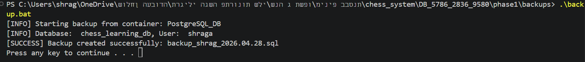
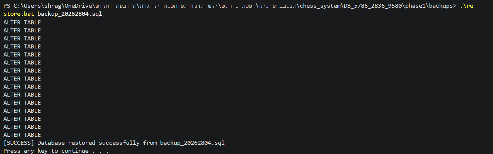

# Chess Learning & Puzzles Platform

Authors: Avraham Shaviro & Shraga Chesrak

## Table of Contents

- [Chess Learning \& Puzzles Platform](#chess-learning--puzzles-platform)
  - [Table of Contents](#table-of-contents)
  - [Phase 1: Design and Build the Database](#phase-1-design-and-build-the-database)
    - [Introduction](#introduction)
      - [Purpose of the Database](#purpose-of-the-database)
      - [Potential Use Cases](#potential-use-cases)
    - [ERD (Entity-Relationship Diagram)](#erd-entity-relationship-diagram)
    - [DSD (Data Structure Diagram)](#dsd-data-structure-diagram)
    - [SQL Scripts](#sql-scripts)
    - [Backup](#backup)
      - [First Way: Using pgadmin interface:](#first-way-using-pgadmin-interface)
      - [Second Way: Using CLI:](#second-way-using-cli)
  - [Phase 2: Integration](#phase-2-integration)
    - [שאילתות SELECT כפולות](#שאילתות-select-כפולות)
    - [שאילתות SELECT נוספות](#שאילתות-select-נוספות)
    - [שאילתות UPDATE ו-DELETE](#שאילתות-update-ו-delete)
    - [אילוצים (Constraints)](#אילוצים-constraints)
    - [טרנזקציות (Commit \& Rollback)](#טרנזקציות-commit--rollback)
    - [אינדקסים (Indexes)](#אינדקסים-indexes)

## Phase 1: Design and Build the Database

### Introduction

The **Chess Learning & Puzzles Database** is designed to efficiently manage an educational platform where users can enroll in courses, read chapters, and solve chess puzzles. This system ensures smooth organization and tracking of user progress, course structures, puzzle difficulty, and daily challenges.

#### Purpose of the Database

This database serves as a structured and reliable solution for the platform to:

- **Manage courses and chapters**, allowing structured content delivery to users.
- **Store chess puzzles**, including FEN strings, solution moves, tags, and difficulty ratings (ELO).
- **Track user attempts**, recording success rates and time taken to solve puzzles.
- **Monitor course progress**, keeping track of when users start and complete specific courses.
- **Offer Daily Puzzles** with unique dates and bonus XP rewards for consistent engagement.

#### Potential Use Cases

- **Platform Administrators / Instructors** can use this database to create new courses, upload puzzles, and assign daily challenges.
- **Users (Students/Players)** can track their learning progress, review their puzzle-solving history, and see their course completion status.
- **System Analytics** can utilize the puzzle attempt records to adjust the difficulty ELO of puzzles based on how many users succeed or fail, and calculate the average time taken.

This structured database helps streamline the e-learning experience, improving content organization and user tracking.

### ERD (Entity-Relationship Diagram)


### DSD (Data Structure Diagram)


### SQL Scripts

Provide the following SQL scripts:

- **Create Tables Script** - The SQL script for creating the database tables is available in the repository:

📜 **[View `create_tables.sql`](phase1/scripts/create_tables.sql)**

- **Insert Data Script** - The SQL script for insert data to the database tables is available in the repository:

📜 **[View `insert_tables.sql`](phase1/scripts/insert_tables.sql)**

- **Drop Tables Script** - The SQL script for droping all tables is available in the repository:

📜 **[View `drop_tables.sql`](phase1/scripts/drop_tables.sql)**

- **Select All Data Script** - The SQL script for selectAll tables is available in the repository:

📜 **[View `select_all.sql`](phase1/scripts/select_all.sql)** - **Count All Data Script** - The SQL script for countAll tables is available in the repository:

📜 **[View `count_all.sql`](phase1/scripts/count_all.sql)** #### First tool: using [mockaro](https://www.mockaroo.com/)


📜 **[View `mockarooFiles`](phase1/mockarooFiles)** #### Second tool: using python script to create csv file from imported real data

📜 **[View `DAILY_PUZZLES.py`](phase1/programming/DAILY_PUZZLES.py)** 📜 **[View `DAILY_PUZZLES.py`](phase1/programming/PUZZLE_ATTEMPT.py)** #### Third tool: using python script to create csv file from imported real data

📜 **[View `puzzles_and_tags.py`](phase1/programming/puzzles_and_tags.py)** ####  After running the `create_tables.sql`, `insert_tables.sql` and `count_all.sql` scripts, we can see the following result:


### Backup

#### First Way: Using pgadmin interface:


#### Second Way: Using CLI:





---

## Phase 2: Integration

### שאילתות SELECT כפולות

חלק זה מציג 4 זוגות של שאילתות המבצעות את אותה הפעולה בדרכים שונות, תוך השוואת היעילות ביניהן.

**1. משתמשים שסיימו קורסים בשנת 2026**
* **תיאור:** שאילתא המחזירה את מזהה המשתמש, שם הקורס ותאריך הסיום, עבור משתמשים שסיימו קורס בהצלחה במהלך שנת 2026.
* **קוד שאילתא א' (שימוש ב-JOIN):**
    ```sql
    SELECT DISTINCT U.user_id, C.title, CP.completion_date
    FROM USERS U
    JOIN COURSE_PROGRESS CP ON U.user_id = CP.user_id
    JOIN COURSES C ON CP.course_id = C.course_id
    WHERE CP.is_completed = TRUE 
    AND EXTRACT(YEAR FROM CP.completion_date) = 2026;
    ```
* **קוד שאילתא ב' (שימוש ב-IN ובתת-שאילתא ב-SELECT):**
    ```sql
    SELECT user_id, 
           (SELECT title FROM COURSES WHERE course_id = CP.course_id) AS course_name,
           completion_date
    FROM COURSE_PROGRESS CP
    WHERE is_completed = TRUE 
    AND course_id IN (SELECT course_id FROM COURSES)
    AND EXTRACT(YEAR FROM completion_date) = 2026;
    ```
* **הסבר והבדלי יעילות:** השימוש ב-JOIN לרוב יעיל יותר מכיוון שמנוע בסיס הנתונים יודע לבצע אופטימיזציה לחיבור בין טבלאות באופן מקביל. שימוש ב-IN, ובמיוחד תת-שאילתא בשורת ה-SELECT, מאלץ את המנוע לבצע פעולת שליפה עבור כל שורה בנפרד (N+1 בעיות), מה שעשוי להאט משמעותית את הביצועים על כמויות מידע גדולות.
* **צילום הרצה:** ``
* **צילום תוצאה:** ``

**2. חידות שלא הופיעו כ"חידה יומית"**
* **תיאור:** שליפת מזהה החידה והדירוג (ELO) שלה עבור חידות שמעולם לא שובצו כחידה יומית.
* **קוד שאילתא א' (שימוש ב-NOT IN):**
    ```sql
    SELECT puzzle_id, difficulty_elo 
    FROM PUZZLES
    WHERE puzzle_id NOT IN (SELECT puzzle_id FROM DAILY_PUZZLES);
    ```
* **קוד שאילתא ב' (שימוש ב-LEFT JOIN):**
    ```sql
    SELECT P.puzzle_id, P.difficulty_elo
    FROM PUZZLES P
    LEFT JOIN DAILY_PUZZLES DP ON P.puzzle_id = DP.puzzle_id
    WHERE DP.daily_puzzle_id IS NULL;
    ```
* **הסבר והבדלי יעילות:** כאשר ישנם ערכי NULL בעמודות המעורבות, `NOT IN` עלול להחזיר תוצאות לא צפויות (קבוצה ריקה) או לדרוש סריקה מלאה. `LEFT JOIN` בתוספת `IS NULL` בטוח יותר מבחינה לוגית כשיש NULLs, ומנועי DB מודרניים מבצעים לו אופטימיזציה מצוינת (Anti-Join), לכן הוא נחשב לאמין ויעיל מאוד למטרה זו.
* **צילום הרצה:** ``
* **צילום תוצאה:** ``

**3. משתמשים שלא פתרו אף חידה**
* **תיאור:** מציאת מזהי המשתמשים שאין להם אף רשומה בטבלת הניסיונות לפתרון חידות.
* **קוד שאילתא א' (שימוש ב-NOT IN):**
    ```sql
    SELECT user_id 
    FROM USERS
    WHERE user_id NOT IN (SELECT user_id FROM PUZZLE_ATTEMPT);
    ```
* **קוד שאילתא ב' (שימוש ב-NOT EXISTS):**
    ```sql
    SELECT U.user_id 
    FROM USERS U
    WHERE NOT EXISTS (
        SELECT 1 
        FROM PUZZLE_ATTEMPT PA 
        WHERE PA.user_id = U.user_id
    );
    ```
* **הסבר והבדלי יעילות:** השימוש ב-`NOT EXISTS` יעיל בהרבה עקב מנגנון "פרישה מוקדמת" (Early Exit). ברגע שמנוע ה-DB מוצא רשומה אחת שתואמת לתנאי בתוך התת-שאילתא, הוא עוצר את הבדיקה עבור אותו משתמש וממשיך הלאה. לעומת זאת, `NOT IN` יחפש בכל הרשימה במלואה וישווה ערך ערך.
* **צילום הרצה:** ``
* **צילום תוצאה:** ``

**4. חידות קשות מהממוצע**
* **תיאור:** שליפת מזהי החידות שהדירוג (ELO) שלהן גבוה מהדירוג הממוצע של כלל החידות במערכת.
* **קוד שאילתא א' (תת-שאילתה ב-WHERE):**
    ```sql
    SELECT puzzle_id, difficulty_elo 
    FROM PUZZLES 
    WHERE difficulty_elo > (
        SELECT AVG(difficulty_elo) 
        FROM PUZZLES
    );
    ```
* **קוד שאילתא ב' (טבלה נגזרת / CTE):**
    ```sql
    WITH(avg_elo AS (SELECT AVG(difficulty_elo) FROM PUZZLES))
    SELECT puzzle_id, difficulty_elo 
    FROM PUZZLES 
    WHERE difficulty_elo > (SELECT avg_elo FROM avg_elo);
    ```
* **הסבר והבדלי יעילות:** שימוש ב-CTE (או בטבלה נגזרת ב-FROM כפי שמופיע בקובץ) מחשב את הממוצע פעם אחת בלבד ושומר אותו בזיכרון לשימוש השאילתא העיקרית. תת-שאילתא ב-WHERE עלולה להיות מחושבת מחדש עבור כל שורה בטבלה (תלוי באופטימייזר), מה שהופך את גישת ה-CTE או הטבלה הנגזרת ליעילה וקריאה יותר.
* **צילום הרצה:** ``
* **צילום תוצאה:** ``

---

### שאילתות SELECT נוספות

**1. דירוג משתמשים לפי אחוזי הצלחה**
* **תיאור:** הצגת נתוני הצלחה בפתרון חידות למשתמשים (עם מעל 5 ניסיונות), כולל סך הניסיונות, כמות ההצלחות ואחוז ההצלחה מקובץ לפי חודש.
* **קוד שאילתא:**
    ```sql
    SELECT 
        U.user_id,
        COUNT(PA.attempt_id) AS total_attempts,
        SUM(CASE WHEN PA.is_successful THEN 1 ELSE 0 END) AS success_count,
        ROUND(AVG(CASE WHEN PA.is_successful THEN 1 ELSE 0 END) * 100, 2) AS success_rate,
        EXTRACT(MONTH FROM PA.attempt_date) AS attempt_month
    FROM USERS U
    JOIN PUZZLE_ATTEMPT PA ON U.user_id = PA.user_id
    GROUP BY U.user_id, EXTRACT(MONTH FROM PA.attempt_date)
    HAVING COUNT(PA.attempt_id) > 5
    ORDER BY success_rate DESC;
    ```
* **צילום הרצה:** ``
* **צילום תוצאה:** ``

**2. חידות עם אחוז הצלחה נמוך מ-40%**
* **תיאור:** איתור החידות הקשות ביותר במערכת שאחוז ההצלחה בהן נמוך מ-40%, כולל כמות הפעמים ששיחקו בהן.
* **קוד שאילתא:**
    ```sql
    SELECT P.puzzle_id, P.difficulty_elo, T.tag_name, 
           (SELECT COUNT(*) FROM PUZZLE_ATTEMPT WHERE puzzle_id = P.puzzle_id) as total_plays
    FROM PUZZLES P
    JOIN TAGS T ON P.tag_id = T.tag_id
    WHERE P.puzzle_id IN (
        SELECT puzzle_id 
        FROM PUZZLE_ATTEMPT 
        GROUP BY puzzle_id 
        HAVING AVG(CASE WHEN is_successful THEN 1 ELSE 0 END) < 0.4
    )
    ORDER BY total_plays DESC;
    ```
* **צילום הרצה:** ``
* **צילום תוצאה:** ``

**3. היום העמוס ביותר בפתרון חידות יומיות**
* **תיאור:** ניתוח המציג באיזה יום בשבוע ישנה את כמות הניסיונות הגדולה ביותר לפתרון חידות יומיות, וכן את ממוצע הזמן שלקח לפתור אותן.
* **קוד שאילתא:**
    ```sql
    SELECT 
        TO_CHAR(PA.attempt_date, 'Day') AS day_name,
        COUNT(*) AS attempt_count,
        AVG(PA.time_taken_sec) AS avg_solve_time
    FROM PUZZLE_ATTEMPT PA
    JOIN DAILY_PUZZLES DP ON PA.puzzle_id = DP.puzzle_id
    GROUP BY TO_CHAR(PA.attempt_date, 'Day')
    ORDER BY attempt_count DESC;
    ```
* **צילום הרצה:** ``
* **צילום תוצאה:** ``

**4. סטטוס התקדמות בקורסים**
* **תיאור:** הצגת פרטי משתמשים שסיימו קורסים במהלך שנת 2026, כולל תאריך התחלה, תאריך סיום וחישוב של מספר הימים שלקח להם לסיים את הקורס.
* **קוד שאילתא:**
    ```sql
    SELECT 
        U.user_id, 
        C.title AS course_name,
        CP.start_date,
        CP.completion_date,
        (CP.completion_date - CP.start_date) AS days_to_complete
    FROM COURSE_PROGRESS CP
    JOIN USERS U ON CP.user_id = U.user_id
    JOIN COURSES C ON CP.course_id = C.course_id
    WHERE CP.is_completed = TRUE AND EXTRACT(YEAR FROM CP.completion_date) = 2026;
    ```
* **צילום הרצה:** ``
* **צילום תוצאה:** ``

---

### שאילתות UPDATE ו-DELETE

**1. עדכון מטה: הפחתת ELO לחידות קלות**
* **תיאור:** הורדת דרגת הקושי (ELO) ב-100 נקודות לחידות שנפתרו בממוצע בפחות מ-10 שניות.
* **קוד:**
    ```sql
    UPDATE PUZZLES
    SET difficulty_elo = difficulty_elo - 100
    WHERE puzzle_id IN (
        SELECT puzzle_id FROM PUZZLE_ATTEMPT 
        GROUP BY puzzle_id HAVING AVG(time_taken_sec) < 10
    );
    ```
* **צילום הרצה:** ``
* **צילום לפני ואחרי:** ``

**2. עדכון מעלה: העלאת ELO לחידות קשות**
* **תיאור:** העלאת דרגת הקושי (ELO) ב-100 נקודות לחידות שלקח למשתמשים מעל 60 שניות בממוצע לפתור.
* **קוד:**
    ```sql
    UPDATE PUZZLES
    SET difficulty_elo = difficulty_elo + 100
    WHERE puzzle_id IN (
        SELECT puzzle_id FROM PUZZLE_ATTEMPT 
        GROUP BY puzzle_id HAVING AVG(time_taken_sec) > 60
    );
    ```
* **צילום הרצה:** ``
* **צילום לפני ואחרי:** ``

**3. עדכון בונוס: הוספת XP לחידות ביום ראשון**
* **תיאור:** הוספת 10 נקודות בונוס ניסיון (XP) לחידות יומיות שפורסמו ביום ראשון (DOW = 0).
* **קוד:**
    ```sql
    UPDATE DAILY_PUZZLES
    SET bonus_xp = bonus_xp +10
    WHERE EXTRACT(DOW FROM puzzle_date) IN (0); 
    ```
* **צילום הרצה:** ``
* **צילום לפני ואחרי:** ``

**4. מחיקת ניסיונות פתרון ישנים**
* **תיאור:** מחיקת רשומות של ניסיונות פתרון שהתבצעו לפני שנת 2000.
* **קוד:**
    ```sql
    DELETE FROM PUZZLE_ATTEMPT
    WHERE attempt_date < '2000-01-01';
    ```
* **צילום הרצה:** ``
* **צילום לפני ואחרי:** ``

**5. מחיקת התקדמות קורסים ישנה**
* **תיאור:** מחיקת רישומי התקדמות קורסים שהחלו לפני שנת 2000.
* **קוד:**
    ```sql
    DELETE FROM COURSE_PROGRESS
    WHERE start_date < '2000-01-01';
    ```
* **צילום הרצה:** ``
* **צילום לפני ואחרי:** ``

**6. מחיקת קורסים ריקים**
* **תיאור:** מחיקת קורסים שאין להם אף פרק מקושר בטבלת הפרקים.
* **קוד:**
    ```sql
    DELETE FROM COURSES
    WHERE course_id NOT IN (SELECT course_id FROM CHAPTERS);
    ```
* **צילום הרצה:** ``
* **צילום לפני ואחרי:** ``

---

### אילוצים (Constraints)

**1. תאימות נתוני סיום קורס**
* **תיאור:** אילוץ המוודא שאם קורס מסומן כהושלם, תאריך הסיום אינו ריק, ולהיפך.
* **קוד:** ```sql
    ALTER TABLE COURSE_PROGRESS 
    ADD CONSTRAINT check_completion_consistency 
    CHECK ((is_completed = TRUE AND completion_date IS NOT NULL) OR (is_completed = FALSE AND completion_date IS NULL));
    ```
* **הפרת האילוץ ושגיאה:** ``

**2. הגיוניות תאריכים**
* **תיאור:** אילוץ המוודא שתאריך סיום הקורס יהיה גדול או שווה לתאריך ההתחלה.
* **קוד:**
    ```sql
    ALTER TABLE COURSE_PROGRESS 
    ADD CONSTRAINT check_dates_order CHECK (completion_date >= start_date);
    ```
* **הפרת האילוץ ושגיאה:** ``

**3. ייחודיות סדר פרקים**
* **תיאור:** אילוץ המונע מצב שבו לאותו קורס יש שני פרקים בעלי אותו מספר סדרתי.
* **קוד:**
    ```sql
    ALTER TABLE CHAPTERS 
    ADD CONSTRAINT unique_chapter_order_per_course UNIQUE (course_id, chapter_order);
    ```
* **הפרת האילוץ ושגיאה:** ``

---

### טרנזקציות (Commit & Rollback)

חלק זה מדגים את השימוש בטרנזקציות בבסיס הנתונים.

**הדגמת ROLLBACK:**
ביצוע הכנסת נתון שגוי לטבלת TAGS, בדיקה שהוא קיים בתוך הטרנזקציה, וביצוע ביטול (Rollback). הנתון נעלם בסוף התהליך.
* **קוד הרצה:** ```sql
    BEGIN;
    INSERT INTO TAGS (tag_name, description) VALUES ('Test Tag', 'This should be rolled back');
    SELECT * FROM TAGS WHERE tag_name = 'Test Tag';
    ROLLBACK;
    SELECT * FROM TAGS WHERE tag_name = 'Test Tag';
    ```
* **מצב בסיס נתונים בכל שלב:** ``

**הדגמת COMMIT:**
הכנסת נתון חדש ושמירתו לצמיתות בבסיס הנתונים באמצעות הפקודה Commit.
* **קוד הרצה:**
    ```sql
    BEGIN;
    INSERT INTO TAGS (tag_name, description) VALUES ('Commit Tag', 'This should be saved');
    SELECT * FROM TAGS WHERE tag_name = 'Commit Tag';
    COMMIT;
    SELECT * FROM TAGS WHERE tag_name = 'Commit Tag';
    ```
* **מצב בסיס נתונים בכל שלב:** ``

---

### אינדקסים (Indexes)

על מנת לייעל את זמן הריצה של השאילתות, הוספנו אינדקסים לשדות המשמשים בתדירות גבוהה לתנאים (WHERE) וקישורים (JOIN).

* **קוד האינדקסים:**
    ```sql
    CREATE INDEX idx_puzzles_difficulty ON PUZZLES(difficulty_elo);
    CREATE INDEX idx_puzzle_attempts_user ON PUZZLE_ATTEMPT(user_id);
    CREATE INDEX idx_chapters_course ON CHAPTERS(course_id);
    ```

* **בדיקת זמני ריצה (לפני ואחרי):**
    בדקנו את שאילתת חיפוש חידות קשות מהממוצע ואת שאילתת אחוזי ההצלחה של משתמשים. טרם יצירת האינדקסים, בסיס הנתונים ביצע סריקה מלאה (Sequential Scan). לאחר הוספת האינדקס, מנוע ה-DB השתמש ב-Index Scan מה שהוביל להקטנת זמן הריצה משמעותית.
* **צילומי מסך זמני ריצה (EXPLAIN ANALYZE):** ``