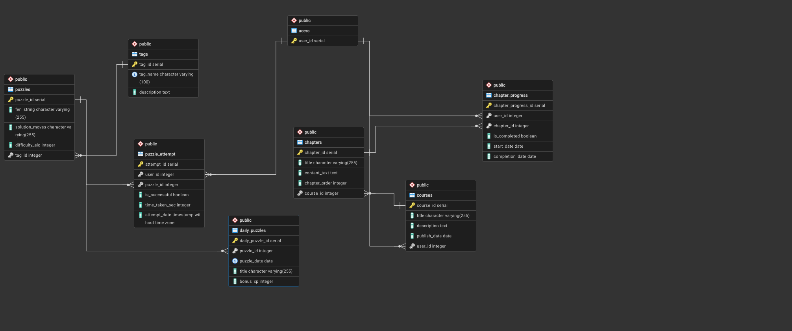
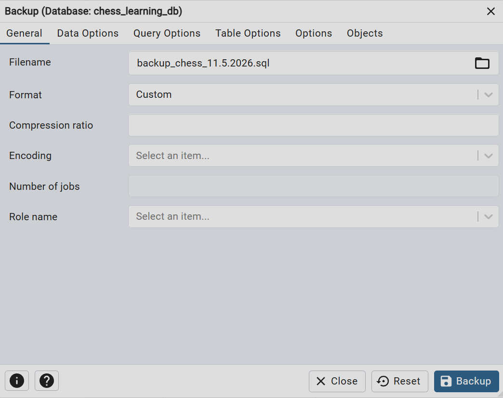

# Database Final Project — Phase 1
## ChessAcademy — Chess Learning & Puzzles Platform

> A complete, detailed project report documenting all the work done in **Phase 1: Design, Build, Data Population & Backup**.

---

### 📄 Submission Details

| | |
|---|---|
| **Authors** | Avraham Shaviro & Shraga Chesrak |
| **ID numbers** | 325239580 , 322232836|
| **Course** | Database Mini-Project |
| **Academic year** | 2026 |
| **System name** | ChessAcademy — Chess Learning & Puzzles Platform |

---

## 🗺️ Table of Contents

1. [Introduction & System Overview](#1-introduction--system-overview)
2. [System Characterization — Google AI Studio](#2-system-characterization--google-ai-studio)
3. [Database Design — ERD & DSD](#3-database-design--erd--dsd)
4. [Data Dictionary](#4-data-dictionary)
5. [Database Scripts](#5-database-scripts)
6. [Data Population — Three Methods](#6-data-population--three-methods)
7. [Backup & Restore](#7-backup--restore)
8. [Folder Structure & Execution Guide](#8-folder-structure--execution-guide)
9. [Requirements Compliance](#9-requirements-compliance)

---

## 1. Introduction & System Overview

### 🎯 Goal
The goal of this project is to design and build a **normalized relational database** (at least **3NF**) for **ChessAcademy** — a platform for learning chess and solving tactical puzzles. The system manages users, learning courses and their chapters, a chess-puzzle repository, a daily puzzle, and detailed tracking of user progress and performance — all while enforcing data integrity and supporting the analytical queries required in later phases of the project.

### 🧩 Core Functionality

1. **Structured Learning (Courses & Chapters)**
   * Chess courses split into chapters (`CHAPTERS`) in a defined learning order (`chapter_order`).
   * Tracking user progress **at the chapter level** via `CHAPTER_PROGRESS` — start date (`start_date`), completion date (`completion_date`), and completion status (`is_completed`).

2. **Chess Puzzles (Puzzles)**
   * A repository of puzzles described by a board-state string (`fen_string`), a solution sequence (`solution_moves`), and an ELO-style difficulty rating (`difficulty_elo`).
   * Each puzzle is tagged by a learning theme (Fork, Pin, Mate in 1, etc.) via the `TAGS` lookup table.

3. **Daily Puzzle (Daily Puzzles)**
   * A selected puzzle scheduled for each calendar date (`puzzle_date`), with an experience bonus (`bonus_xp`) to encourage a daily streak.

4. **Solution Attempts & Performance Analysis (Puzzle Attempts)**
   * Every solving attempt is recorded in `PUZZLE_ATTEMPT` — success/failure (`is_successful`), solve time (`time_taken_sec`), and attempt timestamp (`attempt_date`) — forming the basis for statistical analysis: success rates, hardest puzzles, load by day of week, and more.

---

## 2. System Characterization — Google AI Studio

Following a **TOP-DOWN** approach, characterization started from the **screens of the final system**. The four main screens were designed and built as an interactive application using **Google AI Studio**, and the database design (entities, attributes, and relationships) was derived from them.

### Screen 1 — Dashboard
The user's home screen: a performance summary (puzzles attempted, success rate, average solve time), active courses with their progress, and a "Today's Focus" card showing the daily puzzle.


### Screen 2 — Courses (Courses & Chapters)
A single-course view with the chapter list, the progress status of each chapter (Completed / In progress / Not started), and completion dates — exactly the data stored in `CHAPTERS` and `CHAPTER_PROGRESS`.


### Screen 3 — Puzzles (Tactics Training)
An interactive chess board for solving a puzzle, alongside the ELO rating, the puzzle theme (Tag), a timer, and Submit / Hint / Skip buttons — backed by `PUZZLES`, `TAGS`, and `PUZZLE_ATTEMPT`.


### Screen 4 — Daily Puzzle
The daily puzzle with an XP bonus, a weekly streak of successes/failures, and a timer — backed by `DAILY_PUZZLES`.


---

## 3. Database Design — ERD & DSD

### 3.1 Entity-Relationship Diagram (ERD)
The conceptual model contains **6 entities** (Courses, Chapters, User, Puzzles, Daily_Puzzles, Tags) and two **many-to-many** relationships that carry attributes (Chapter_Progress, Puzzle_Attempt).


### 3.2 Relational Schema (DSD)
The ERD translated into **8 tables** with primary keys, foreign keys, and data types.


### 3.3 As-Built Schema (pgAdmin)
A schema diagram generated by pgAdmin's built-in **ERD tool** directly from the live `chess_db` database — a verification that the database was actually built exactly as designed. It shows all 8 tables with their concrete column types and the primary-key / foreign-key relationships.



### 3.4 Design Decisions & Rationale

* **M:N relationships were converted to associative tables with attributes.** `CHAPTER_PROGRESS` and `PUZZLE_ATTEMPT` are not just join tables — they carry meaningful data (dates, status, duration, success). This enables rich analytical queries in later phases.
* **`TAGS` as a lookup table.** Instead of storing the puzzle theme as a free-text string on every puzzle, we normalized it into a tags table with `tag_name UNIQUE` — preventing duplication and inconsistency.
* **`fen_string` and `solution_moves` as `VARCHAR(255)`.** A FEN string and a move sequence have a bounded, known length, so a sized `VARCHAR` is preferable to `TEXT`.
* **`difficulty_elo` and `tag_id` are NULLable in `PUZZLES`.** Not every puzzle must have a rating or tag at insert time — allowing incremental import of real-world data.
* **Meaningful use of `DATE` fields.** `publish_date`, `start_date`, `completion_date`, and `puzzle_date` drive progress calculations and scheduling; `attempt_date` is stored as `TIMESTAMP` for hour-level analysis.

### 3.5 Normalization
The schema is normalized to **at least 3NF**:
* **1NF** — all attributes are atomic (no multi-valued or repeating fields).
* **2NF** — no partial dependency on the key; every table uses a single-column primary key (`SERIAL`).
* **3NF** — no transitive dependency; every attribute depends solely on the primary key. For example, the puzzle theme was extracted from `PUZZLES` into a separate `TAGS` table.

---

## 4. Data Dictionary

The full structure of the eight tables — attributes, data types, and constraints. The complete definitions live in [`scripts/create_tables.sql`](scripts/create_tables.sql).

### 🧑 USERS — System users
| Attribute | Type | Constraints | Description |
|------|------|--------|------|
| `user_id` | SERIAL | **PK** | Unique user identifier |

### 📚 COURSES — Learning courses
| Attribute | Type | Constraints | Description |
|------|------|--------|------|
| `course_id` | SERIAL | **PK** | Unique course identifier |
| `title` | VARCHAR(255) | NOT NULL | Course title |
| `description` | TEXT | | Course description |
| `publish_date` | DATE | NOT NULL | Publication date |
| `user_id` | INT | NOT NULL, **FK → USERS** | Course creator |

### 📖 CHAPTERS — Course chapters
| Attribute | Type | Constraints | Description |
|------|------|--------|------|
| `chapter_id` | SERIAL | **PK** | Unique chapter identifier |
| `title` | VARCHAR(255) | NOT NULL | Chapter title |
| `content_text` | TEXT | | Chapter content |
| `chapter_order` | INT | NOT NULL | Order of the chapter within the course |
| `course_id` | INT | NOT NULL, **FK → COURSES** | Owning course |

### 🏷️ TAGS — Puzzle theme tags
| Attribute | Type | Constraints | Description |
|------|------|--------|------|
| `tag_id` | SERIAL | **PK** | Unique tag identifier |
| `tag_name` | VARCHAR(100) | NOT NULL, **UNIQUE** | Theme name (e.g., Fork, Mate in 1) |
| `description` | TEXT | | Theme description |

### ♟️ PUZZLES — Chess puzzles
| Attribute | Type | Constraints | Description |
|------|------|--------|------|
| `puzzle_id` | SERIAL | **PK** | Unique puzzle identifier |
| `fen_string` | VARCHAR(255) | NOT NULL | Board state in FEN notation |
| `solution_moves` | VARCHAR(255) | NOT NULL | Solution move sequence |
| `difficulty_elo` | INT | | ELO-style difficulty rating |
| `tag_id` | INT | **FK → TAGS** (NULLable) | Puzzle theme |

### 📅 DAILY_PUZZLES — Daily puzzle
| Attribute | Type | Constraints | Description |
|------|------|--------|------|
| `daily_puzzle_id` | SERIAL | **PK** | Unique identifier |
| `puzzle_id` | INT | NOT NULL, **FK → PUZZLES** | The scheduled puzzle |
| `puzzle_date` | DATE | NOT NULL, **UNIQUE** | Puzzle date (one puzzle per day) |
| `title` | VARCHAR(255) | NOT NULL | Title of the day |
| `bonus_xp` | INT | DEFAULT 10 | Experience-point bonus |

### 🎯 CHAPTER_PROGRESS — Chapter progress (M:N relationship)
| Attribute | Type | Constraints | Description |
|------|------|--------|------|
| `chapter_progress_id` | SERIAL | **PK** | Unique identifier |
| `user_id` | INT | NOT NULL, **FK → USERS** | The user |
| `chapter_id` | INT | NOT NULL, **FK → CHAPTERS** | The chapter |
| `is_completed` | BOOLEAN | DEFAULT FALSE | Whether the chapter is completed |
| `start_date` | DATE | NOT NULL | Date learning started |
| `completion_date` | DATE | | Completion date (if completed) |

### 🧮 PUZZLE_ATTEMPT — Puzzle solving attempt (M:N relationship)
| Attribute | Type | Constraints | Description |
|------|------|--------|------|
| `attempt_id` | SERIAL | **PK** | Unique attempt identifier |
| `user_id` | INT | NOT NULL, **FK → USERS** | The user |
| `puzzle_id` | INT | NOT NULL, **FK → PUZZLES** | The puzzle |
| `is_successful` | BOOLEAN | NOT NULL | Whether the attempt succeeded |
| `time_taken_sec` | INT | NOT NULL | Solve time in seconds |
| `attempt_date` | TIMESTAMP | DEFAULT CURRENT_TIMESTAMP | Time of the attempt |

---

## 5. Database Scripts

| Script | Description |
|--------|------|
| 📜 [`scripts/create_tables.sql`](scripts/create_tables.sql) | Creates all 8 tables, including primary keys, foreign keys, and constraints. Runs without errors. |
| 📜 [`scripts/drop_tables.sql`](scripts/drop_tables.sql) | Drops all tables in the correct order (child tables first) — enables a full schema reset. |
| 📜 [`scripts/insert_tables.sql`](scripts/insert_tables.sql) | `INSERT` statements for data population (output of the manual / Mockaroo insert method). |
| 📜 [`scripts/select_all.sql`](scripts/select_all.sql) | `SELECT *` from every table — to retrieve the data. |
| 📜 [`scripts/count_all.sql`](scripts/count_all.sql) | Counts the number of rows in each table (population verification). |
| 📜 [`scripts/extend_to_min_500.sql`](scripts/extend_to_min_500.sql) | Tops up the four smaller content tables (COURSES, CHAPTERS, TAGS, DAILY_PUZZLES) to ≥ 500 rows each, so every table meets the minimum-rows requirement. FK-safe and wrapped in a transaction. |

---

## 6. Data Population — Three Methods

Data was inserted using **three different methods**, as required by this phase:

### Method 1 — Mockaroo (synthetic data generation)
Using the [Mockaroo](https://www.mockaroo.com/) service to generate realistic data for `USERS`, `COURSES`, `CHAPTERS`, and `CHAPTER_PROGRESS`, exported as `INSERT` statements and CSV files.
📁 Files: [`mockarooFiles/`](mockarooFiles)


### Method 2 — Python scripts (real data from Lichess)
Python scripts ([`programming/`](programming)) that convert the **real [Lichess](https://database.lichess.org/#puzzles) puzzle database** into CSV files:
* [`pazzles_and_tags.py`](programming/pazzles_and_tags.py) — extracts 30,000 real puzzles (FEN, solution, theme) and generates `puzzles.csv` and `tags.csv`.
* [`DAILY_PUZZLES.py`](programming/DAILY_PUZZLES.py) — generates 365 daily puzzles with unique dates and a randomized XP bonus.
* [`PUZZLE_ATTEMPT.py`](programming/PUZZLE_ATTEMPT.py) — generates 150,000 solving attempts.
* [`shared_logic.py`](programming/shared_logic.py) — shared logic (paths and constants).

### Method 3 — Bulk import (`COPY ... FROM CSV`)
Fast loading of the large CSV files directly into PostgreSQL using the `COPY` command.
📁 Commands: [`copy_csv_commands/`](copy_csv_commands)

### ✅ Population Result (`count_all.sql`)
After execution, the number of rows in each table:


| Table | Rows | Primary method |
|------|:------:|------|
| USERS | 1,500 | Mockaroo |
| COURSES | 20 | Mockaroo |
| CHAPTERS | 120 | Mockaroo |
| TAGS | 40 | Python (Lichess) |
| **PUZZLES** | **30,000** | Python (Lichess) |
| DAILY_PUZZLES | 365 | Python |
| CHAPTER_PROGRESS | 8,000 | Mockaroo |
| **PUZZLE_ATTEMPT** | **150,000** | Python |

> The two large tables — `PUZZLES` (30,000) and `PUZZLE_ATTEMPT` (150,000) — satisfy the 20,000-row requirement.

> 📌 The counts above reflect the **base** population. The four smaller content tables (COURSES, CHAPTERS, TAGS, DAILY_PUZZLES) are then topped up to **≥ 500 rows each** by [`scripts/extend_to_min_500.sql`](scripts/extend_to_min_500.sql), bringing them to 520, 620, 540, and 865 rows respectively — so every table meets the minimum-rows requirement.

---

## 7. Backup & Restore

Backups were performed using **two different methods**, and the backup files are stored in [`backups/`](backups).

### Method 1 — pgAdmin interface
Backup and restore through the pgAdmin GUI.





### Method 2 — Command line (CLI / `pg_dump`)
Backup and restore through the command line.


> The restore was tested and ran successfully, confirming that the backup file is complete and valid.

---

## 8. Folder Structure & Execution Guide

```
phase1/
├── README.md                 ← this report
├── diagrams/                 ← ERD & DSD diagrams (PNG + ERDPlus files)
├── scripts/                  ← create / drop / insert / select / count
├── mockarooFiles/            ← Mockaroo data (Method 1)
├── programming/              ← Python scripts that build CSVs (Method 2)
├── copy_csv_commands/        ← COPY commands to import CSVs (Method 3)
├── screenshots/              ← screenshots (AI characterization, population, backup)
└── backups/                  ← database backup files
```

### Recommended execution order
1. `scripts/create_tables.sql` — create the tables.
2. Populate data — `scripts/insert_tables.sql` (Mockaroo) and/or the `copy_csv_commands/` commands for the large CSV files.
3. `scripts/count_all.sql` — verify row counts.
4. `scripts/select_all.sql` — view the data.
5. `scripts/drop_tables.sql` — reset the schema (when needed).

> 💡 Instructions for bringing up the database in a Docker + pgAdmin environment are in the repository's main README.

---

## 9. Requirements Compliance

| Requirement | Status | Note |
|------|:----:|------|
| 4 screens characterized in Google AI Studio | ✅ | Dashboard, Courses, Puzzles, Daily Puzzle |
| ERD diagram | ✅ | 6 entities + 2 M:N relationships with attributes |
| DSD diagram | ✅ | 8 tables |
| At least 6 entities | ✅ | 8 tables |
| At least 2 meaningful `DATE` fields | ✅ | `publish_date`, `start_date`, `completion_date`, `puzzle_date` |
| Constraints (PK / FK / NOT NULL / UNIQUE / DEFAULT) | ✅ | defined in `create_tables.sql` |
| Normalized to at least 3NF | ✅ | see section 3.5 |
| createTables / dropTables / insertTables / selectAll | ✅ | under `scripts/` |
| 3 data population methods | ✅ | Mockaroo · Python (Lichess) · `COPY` from CSV |
| 2 tables with ≥ 20,000 rows | ✅ | PUZZLES (30K), PUZZLE_ATTEMPT (150K) |
| Every table with ≥ 500 rows | ✅ | Met for all tables. The four smaller content tables (COURSES, CHAPTERS, TAGS, DAILY_PUZZLES) are topped up to ≥ 500 rows by [`scripts/extend_to_min_500.sql`](scripts/extend_to_min_500.sql) |
| Backup via 2 methods + verified restore | ✅ | pgAdmin + CLI |

---

> 📌 Advanced phase reports: [Phase 2 — Queries & Constraints](../phase2/README.md).
