# Chess Learning & Puzzles Platform — Phase 2 (שלב ב)

Authors: Avraham Shaviro & Shraga Chesrak

This report documents Phase 2 of the project: analytical `SELECT` queries,
paired queries for efficiency comparison, `UPDATE` / `DELETE` statements,
integrity constraints, transactions (`COMMIT` / `ROLLBACK`), and indexes.

## Source files (`phase2/scripts/`)

| Content | File |
|---|---|
| All SELECT / UPDATE / DELETE statements | `Queries.sql` |
| The 3 CHECK / UNIQUE constraints | `Constraints.sql` |
| ROLLBACK and COMMIT demos | `RollbackCommit.sql` |
| The 3 indexes | `Index.sql` |
| Demo / edge-case data (see note below) | `SeedDemoData.sql`, `CleanupDemoData.sql` |

### Note on demo data

The generated mock data is very uniform (solve times 15–900s, all attempts in
2023, ~65% success), so several threshold-based queries (struggling users, very
hard puzzles, etc.) returned no rows. `SeedDemoData.sql` inserts a small amount
of clearly-marked demo data (`DEMO/...` puzzles, the `DEMO_HARD_TOPIC` tag, a
`DEMO_EMPTY_COURSE`, and 6 demo users) so every query returns meaningful rows
for the screenshots. `CleanupDemoData.sql` removes it again.

## Table of Contents

- [Paired SELECT Queries (efficiency comparison)](#paired-select-queries-efficiency-comparison)
- [Additional SELECT Queries](#additional-select-queries)
- [UPDATE & DELETE Queries](#update--delete-queries)
- [Constraints](#constraints)
- [Transactions (Commit & Rollback)](#transactions-commit--rollback)
- [Indexes](#indexes)

---

## Paired SELECT Queries (efficiency comparison)

Four queries, each written in **two different forms** that return the same
result, to compare their efficiency. A screenshot is provided per form.

> Source: `Queries.sql`, queries 7–10.

### Pair 7 — Chapter completions per course in 2023

For every course: how many distinct users completed chapters in it during 2023,
and how many chapters in total.

**Form A — direct JOIN:**
```sql
SELECT C.title AS course_name,
       COUNT(DISTINCT CP.user_id) AS users_completed,
       COUNT(*)                   AS chapters_completed
FROM CHAPTER_PROGRESS CP
JOIN CHAPTERS CH ON CP.chapter_id = CH.chapter_id
JOIN COURSES  C  ON CH.course_id  = C.course_id
WHERE CP.is_completed = TRUE AND EXTRACT(YEAR FROM CP.completion_date) = 2023
GROUP BY C.title
ORDER BY users_completed DESC;
```

**Form B — CTE that filters first, then joins:**
```sql
WITH completed_2023 AS (
    SELECT CP.user_id, CH.course_id
    FROM CHAPTER_PROGRESS CP
    JOIN CHAPTERS CH ON CP.chapter_id = CH.chapter_id
    WHERE CP.is_completed = TRUE AND EXTRACT(YEAR FROM CP.completion_date) = 2023
)
SELECT C.title AS course_name,
       COUNT(DISTINCT cc.user_id) AS users_completed,
       COUNT(*)                   AS chapters_completed
FROM completed_2023 cc
JOIN COURSES C ON cc.course_id = C.course_id
GROUP BY C.title
ORDER BY users_completed DESC;
```

**Which is more efficient:** Form B filters the 2023 completions inside the CTE
first, so the join to `COURSES` and the grouping run on fewer rows. In modern
PostgreSQL the CTE is inlined and the optimizer can push the filter down, so the
plans are often similar; when the year filter is selective, Form B tends to be
faster.

| Form A (JOIN) | Form B (CTE) |
|---|---|
| 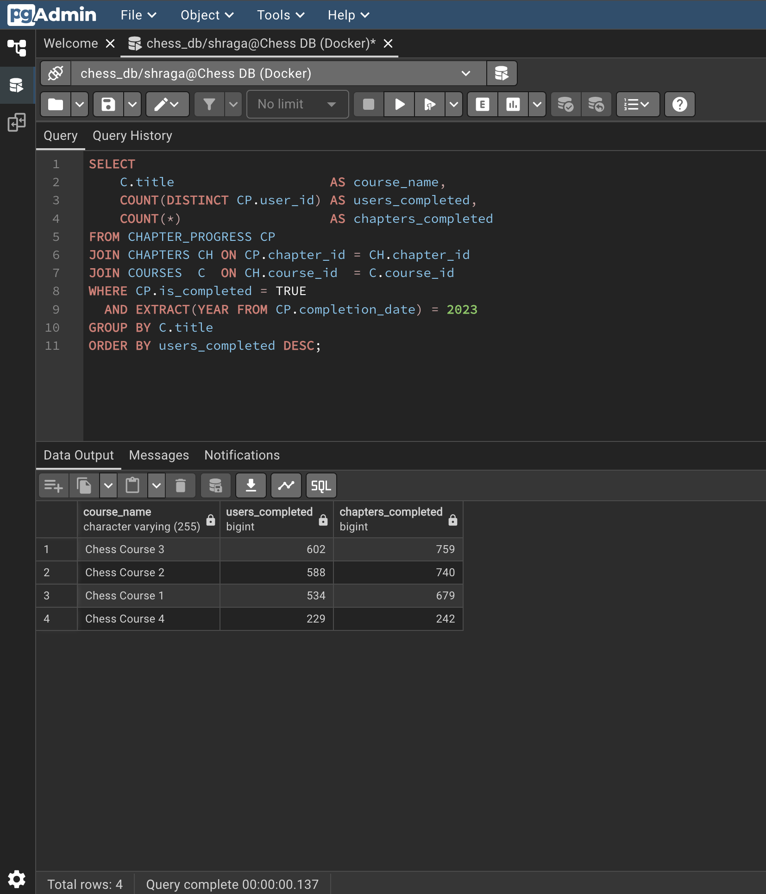 | 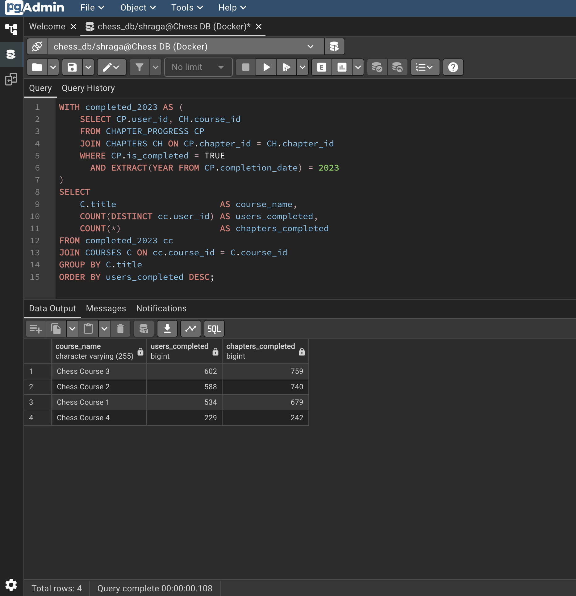 |

### Pair 8 — Puzzles never used as a daily puzzle, per tag

**Form A — anti-join with LEFT JOIN + IS NULL:**
```sql
SELECT T.tag_name, COUNT(*) AS never_daily_count, ROUND(AVG(P.difficulty_elo), 0) AS avg_elo
FROM PUZZLES P
JOIN TAGS T ON P.tag_id = T.tag_id
LEFT JOIN DAILY_PUZZLES DP ON P.puzzle_id = DP.puzzle_id
WHERE DP.daily_puzzle_id IS NULL
GROUP BY T.tag_name
ORDER BY never_daily_count DESC;
```

**Form B — NOT EXISTS:**
```sql
SELECT T.tag_name, COUNT(*) AS never_daily_count, ROUND(AVG(P.difficulty_elo), 0) AS avg_elo
FROM PUZZLES P
JOIN TAGS T ON P.tag_id = T.tag_id
WHERE NOT EXISTS (SELECT 1 FROM DAILY_PUZZLES DP WHERE DP.puzzle_id = P.puzzle_id)
GROUP BY T.tag_name
ORDER BY never_daily_count DESC;
```

**Which is more efficient:** Both express an anti-join and PostgreSQL usually
runs both as a Hash Anti Join with similar cost. `NOT EXISTS` is clearer and
cannot produce duplicate rows, whereas `LEFT JOIN + IS NULL` can build a larger
intermediate result before the `IS NULL` filter removes the matched rows.

| Form A (LEFT JOIN + IS NULL) | Form B (NOT EXISTS) |
|---|---|
| 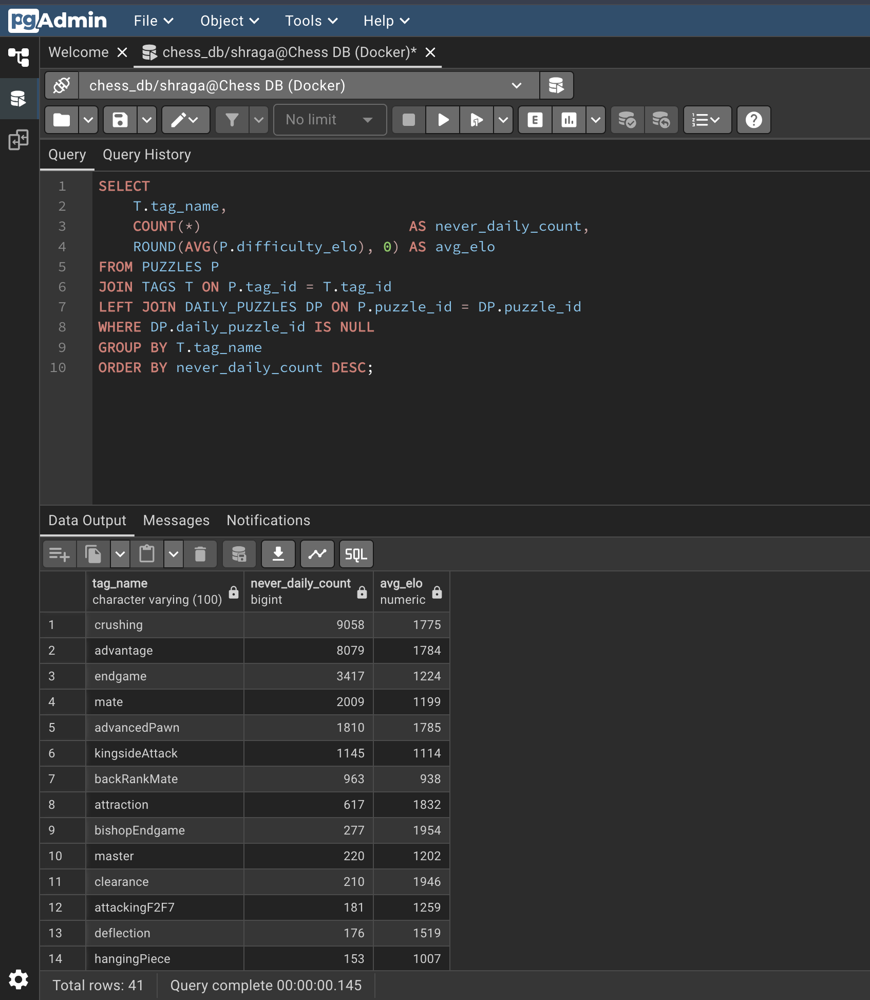 | 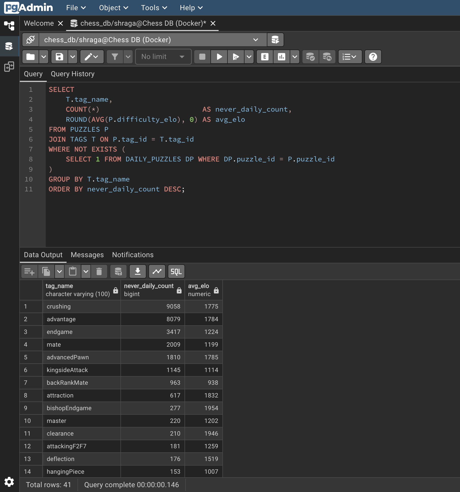 |

### Pair 9 — Puzzles harder than the overall average, by difficulty band

**Form A — scalar sub-query in WHERE:**
```sql
SELECT CASE WHEN difficulty_elo < 1500 THEN 'easy'
            WHEN difficulty_elo < 2000 THEN 'medium' ELSE 'hard' END AS elo_band,
       COUNT(*) AS puzzles_above_avg, ROUND(AVG(difficulty_elo), 0) AS avg_band_elo
FROM PUZZLES
WHERE difficulty_elo > (SELECT AVG(difficulty_elo) FROM PUZZLES)
GROUP BY elo_band ORDER BY avg_band_elo;
```

**Form B — CTE that computes the average once:**
```sql
WITH avg_elo AS (SELECT AVG(difficulty_elo) AS a FROM PUZZLES)
SELECT CASE WHEN difficulty_elo < 1500 THEN 'easy'
            WHEN difficulty_elo < 2000 THEN 'medium' ELSE 'hard' END AS elo_band,
       COUNT(*) AS puzzles_above_avg, ROUND(AVG(difficulty_elo), 0) AS avg_band_elo
FROM PUZZLES, avg_elo
WHERE difficulty_elo > avg_elo.a
GROUP BY elo_band ORDER BY avg_band_elo;
```

**Which is more efficient:** The sub-query is **uncorrelated**, so PostgreSQL
evaluates it only once (as an InitPlan). The two forms are effectively
equivalent and their run-times are nearly identical; the CTE form mainly
improves readability. (Had the sub-query been *correlated*, it would be
recomputed per row and the CTE form would be far faster.)

| Form A (sub-query in WHERE) | Form B (CTE) |
|---|---|
| 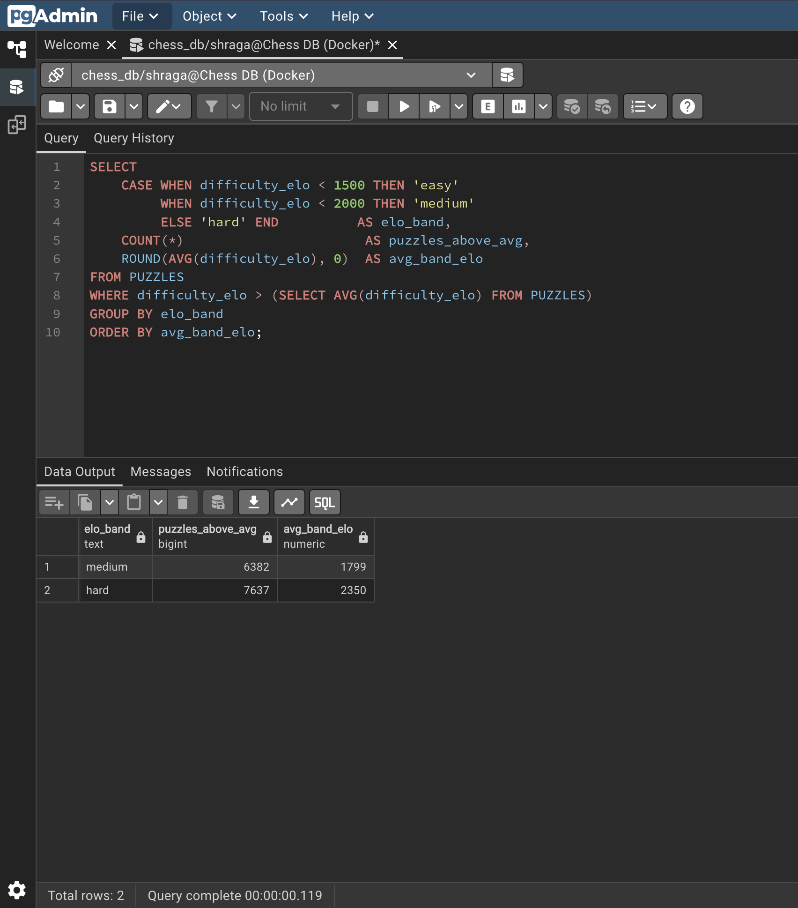 | 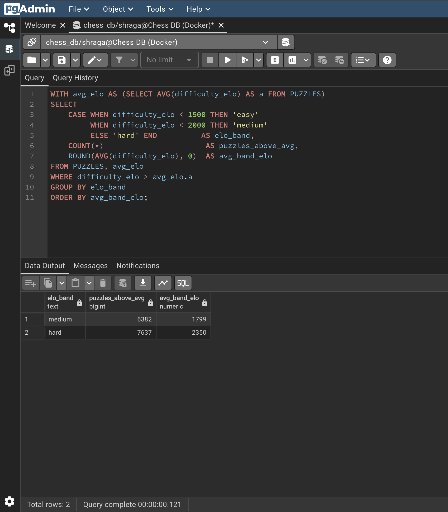 |

### Pair 10 — Daily-puzzle load by day of week

**Form A — group by day name (TO_CHAR):**
```sql
SELECT TRIM(TO_CHAR(PA.attempt_date, 'Day')) AS day_name,
       COUNT(*) AS attempt_count, ROUND(AVG(PA.time_taken_sec), 1) AS avg_solve_time
FROM PUZZLE_ATTEMPT PA
JOIN DAILY_PUZZLES DP ON PA.puzzle_id = DP.puzzle_id
GROUP BY TRIM(TO_CHAR(PA.attempt_date, 'Day'))
ORDER BY attempt_count DESC;
```

**Form B — group by weekday number (EXTRACT DOW):**
```sql
SELECT EXTRACT(DOW FROM PA.attempt_date) AS day_of_week,
       COUNT(*) AS attempt_count, ROUND(AVG(PA.time_taken_sec), 1) AS avg_solve_time
FROM PUZZLE_ATTEMPT PA
JOIN DAILY_PUZZLES DP ON PA.puzzle_id = DP.puzzle_id
GROUP BY EXTRACT(DOW FROM PA.attempt_date)
ORDER BY attempt_count DESC;
```

**Which is more efficient:** `EXTRACT(DOW ...)` returns an integer (0–6);
grouping on an integer is cheaper than grouping on the text string produced by
`TO_CHAR` (which also does a text conversion and blank-padding). Form B is
expected to be slightly faster; Form A is more readable for a human.

| Form A (TO_CHAR) | Form B (EXTRACT DOW) |
|---|---|
| 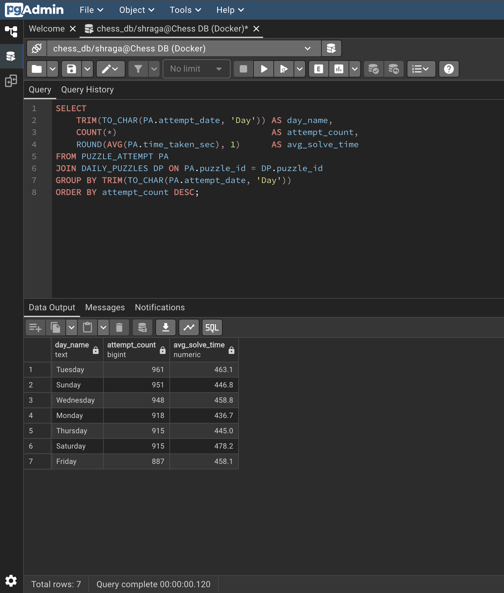 | 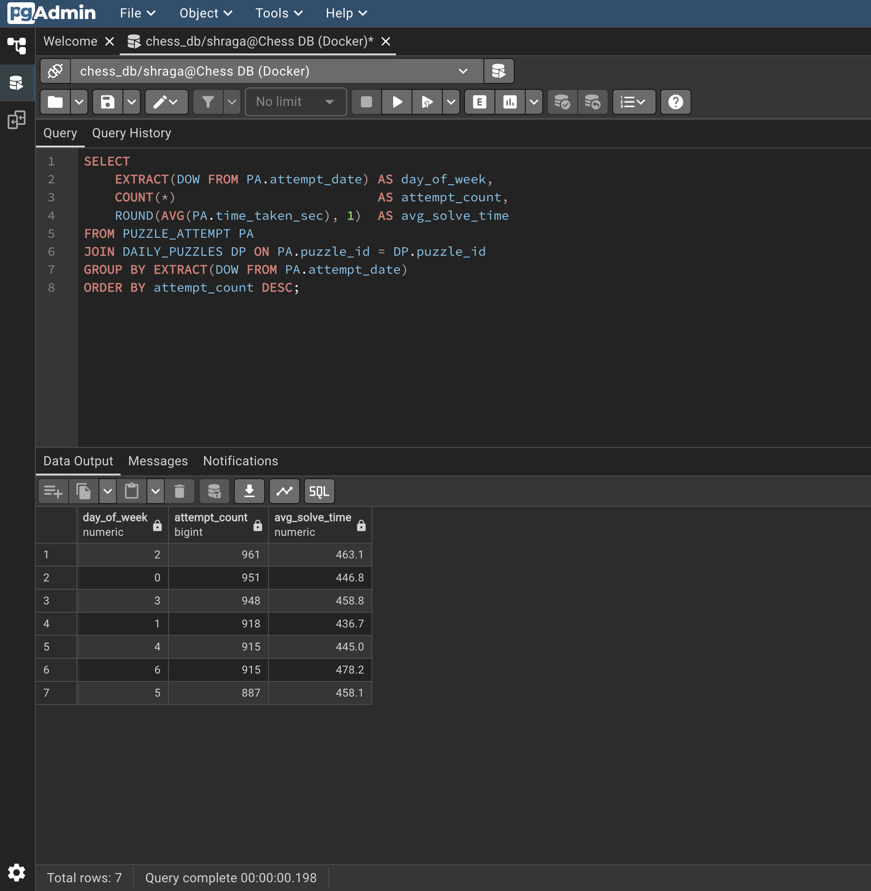 |

---

## Additional SELECT Queries

Six analytical queries (single form). Source: `Queries.sql`, queries 1–6.

### Query 1 — Users who especially struggle
Users with a success rate below 20% even though they attempted at least 20 puzzles.
```sql
SELECT U.user_id, COUNT(PA.attempt_id) AS total_attempts,
       SUM(CASE WHEN PA.is_successful THEN 1 ELSE 0 END) AS success_count,
       ROUND(AVG(CASE WHEN PA.is_successful THEN 1 ELSE 0 END) * 100, 2) AS success_rate
FROM USERS U
JOIN PUZZLE_ATTEMPT PA ON U.user_id = PA.user_id
GROUP BY U.user_id
HAVING COUNT(PA.attempt_id) >= 20 AND AVG(CASE WHEN PA.is_successful THEN 1 ELSE 0 END) < 0.2
ORDER BY success_rate ASC;
```
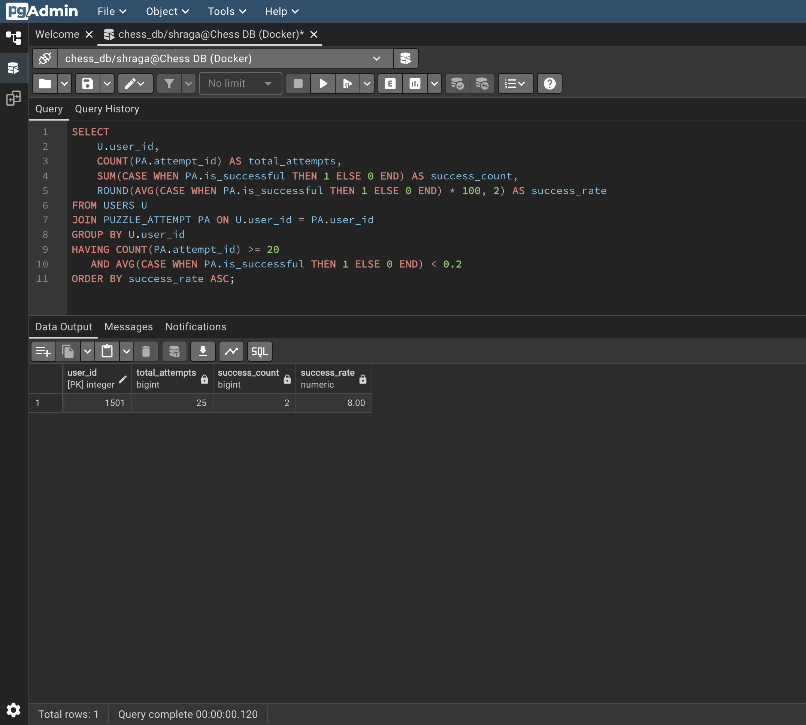

**Result:**

| user_id | total_attempts | success_count | success_rate |
|---|---|---|---|
| 1501 | 25 | 2 | 8.00 |

### Query 2 — Abnormally hard puzzles
Puzzles with a success rate below 10% and an average solve time above 5 minutes, played at least 10 times.
```sql
SELECT P.puzzle_id, P.difficulty_elo, T.tag_name,
       COUNT(PA.attempt_id) as total_plays, ROUND(AVG(PA.time_taken_sec), 2) AS avg_time_sec
FROM PUZZLES P
JOIN TAGS T ON P.tag_id = T.tag_id
JOIN PUZZLE_ATTEMPT PA ON P.puzzle_id = PA.puzzle_id
GROUP BY P.puzzle_id, P.difficulty_elo, T.tag_name
HAVING COUNT(PA.attempt_id) >= 10 AND AVG(CASE WHEN PA.is_successful THEN 1 ELSE 0 END) < 0.1
   AND AVG(PA.time_taken_sec) > 300
ORDER BY avg_time_sec DESC;
```
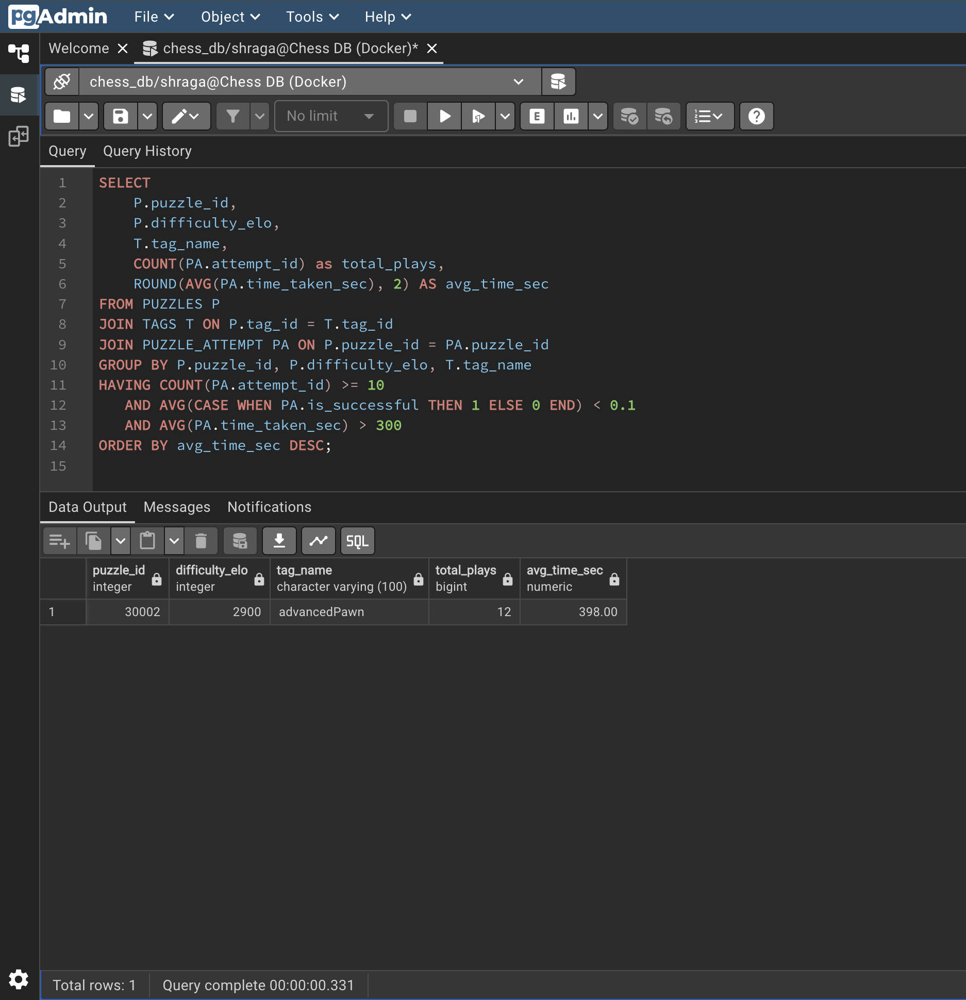

**Result:**

| puzzle_id | difficulty_elo | tag_name | total_plays | avg_time_sec |
|---|---|---|---|---|
| 30002 | 2900 | advancedPawn | 12 | 398.00 |

### Query 3 — Busiest weekday for daily puzzles
Which day of the week has the most daily-puzzle attempts, and the average solve time.
```sql
SELECT TO_CHAR(PA.attempt_date, 'Day') AS day_name,
       COUNT(*) AS attempt_count, ROUND(AVG(PA.time_taken_sec), 2) AS avg_solve_time
FROM PUZZLE_ATTEMPT PA
JOIN DAILY_PUZZLES DP ON PA.puzzle_id = DP.puzzle_id
GROUP BY TO_CHAR(PA.attempt_date, 'Day')
ORDER BY attempt_count DESC;
```
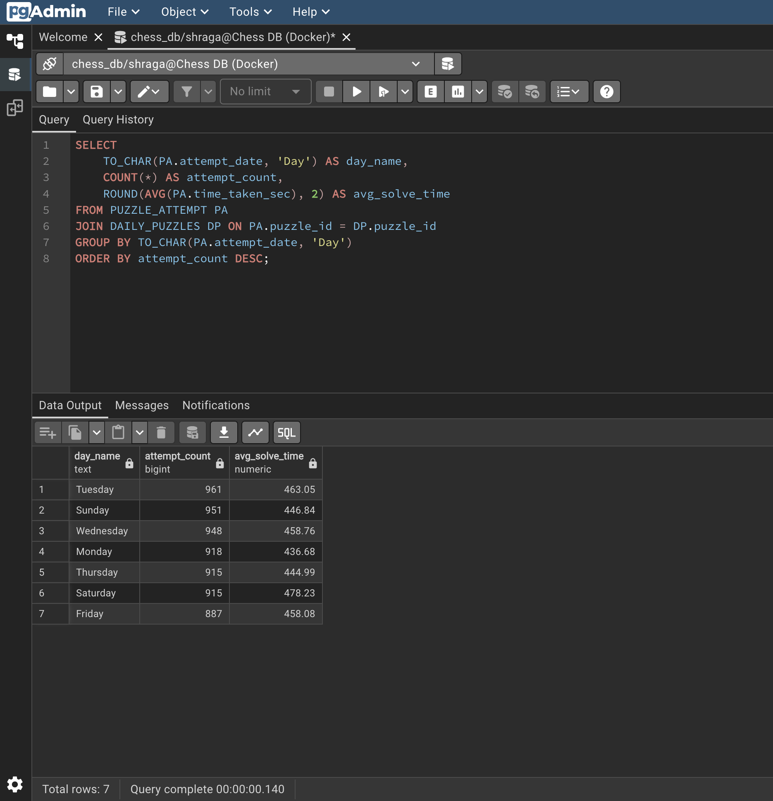

### Query 4 — Top learners (fast course progress)
Users who completed a chapter in under 7 days during 2023.
```sql
SELECT U.user_id, C.title AS course_name, CP.start_date, CP.completion_date,
       (CP.completion_date - CP.start_date) AS days_to_complete
FROM CHAPTER_PROGRESS CP
JOIN USERS U ON CP.user_id = U.user_id
JOIN CHAPTERS CH ON CP.chapter_id = CH.chapter_id
JOIN COURSES C ON CH.course_id = C.course_id
WHERE CP.is_completed = TRUE AND EXTRACT(YEAR FROM CP.completion_date) = 2023
  AND (CP.completion_date - CP.start_date) < 7
ORDER BY days_to_complete ASC;
```
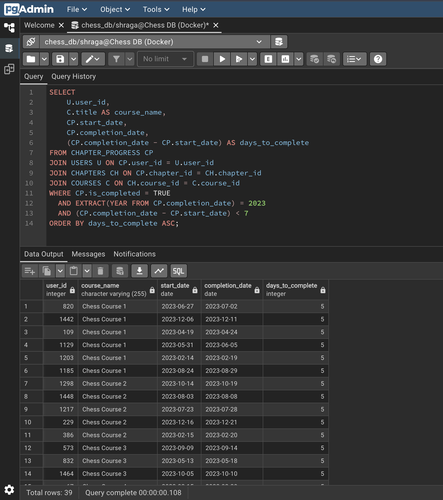

### Query 5 — Popular puzzles that were never promoted
Puzzles never scheduled as a daily puzzle, yet played more than 50 times with a success rate above 80%.
```sql
SELECT P.puzzle_id, P.difficulty_elo, COUNT(PA.attempt_id) AS attempt_count,
       ROUND(AVG(CASE WHEN PA.is_successful THEN 1 ELSE 0 END) * 100, 2) AS success_rate
FROM PUZZLES P
JOIN PUZZLE_ATTEMPT PA ON P.puzzle_id = PA.puzzle_id
LEFT JOIN DAILY_PUZZLES DP ON P.puzzle_id = DP.puzzle_id
WHERE DP.daily_puzzle_id IS NULL
GROUP BY P.puzzle_id, P.difficulty_elo
HAVING COUNT(PA.attempt_id) > 50 AND AVG(CASE WHEN PA.is_successful THEN 1 ELSE 0 END) > 0.8
ORDER BY attempt_count DESC;
```
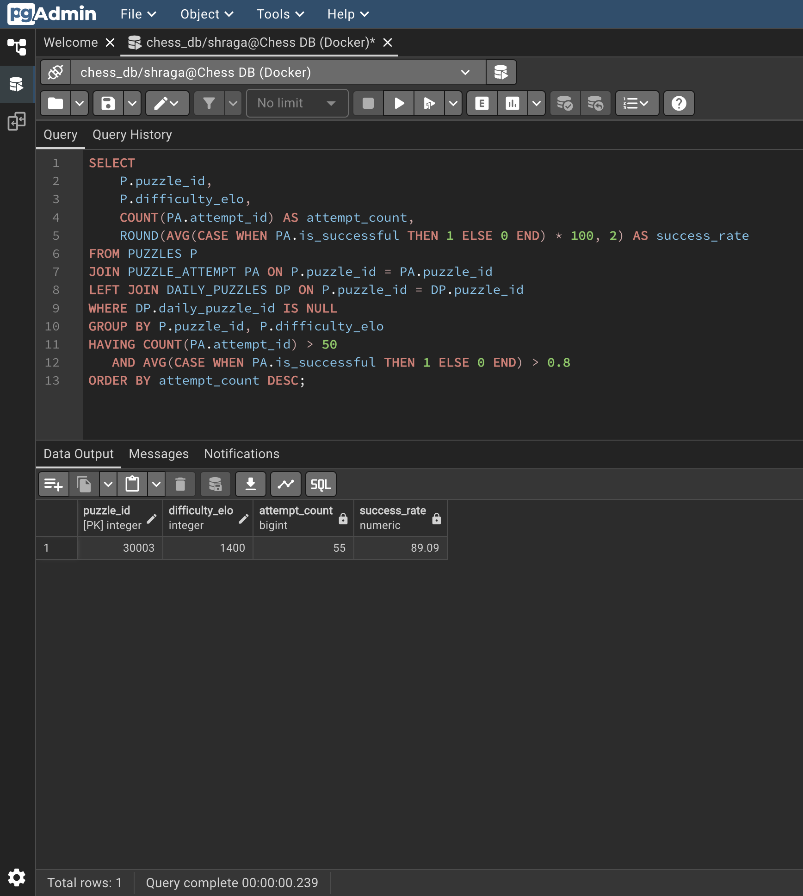

**Result:**

| puzzle_id | difficulty_elo | attempt_count | success_rate |
|---|---|---|---|
| 30003 | 1400 | 55 | 89.09 |

### Query 6 — Problematic tags (topics)
Tags with the lowest success rate (below 25%), used to decide which new courses to create.
```sql
SELECT T.tag_name, COUNT(PA.attempt_id) AS total_attempts,
       ROUND(AVG(CASE WHEN PA.is_successful THEN 1 ELSE 0 END) * 100, 2) AS success_rate
FROM TAGS T
JOIN PUZZLES P ON T.tag_id = P.tag_id
JOIN PUZZLE_ATTEMPT PA ON P.puzzle_id = PA.puzzle_id
GROUP BY T.tag_name
HAVING COUNT(PA.attempt_id) > 100 AND AVG(CASE WHEN PA.is_successful THEN 1 ELSE 0 END) < 0.25
ORDER BY success_rate ASC;
```
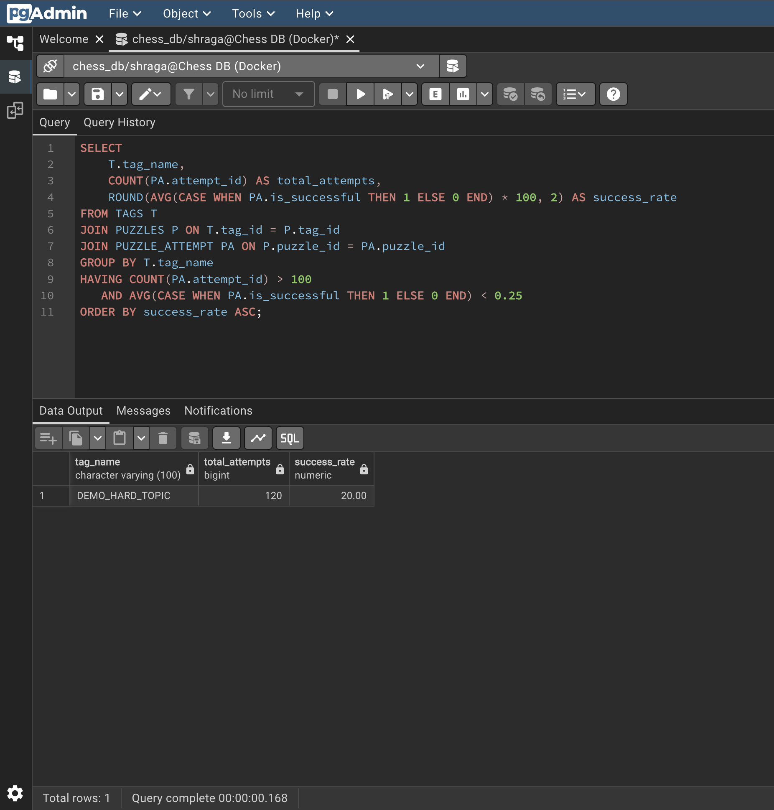

**Result:**

| tag_name | total_attempts | success_rate |
|---|---|---|
| DEMO_HARD_TOPIC | 120 | 20.00 |

---

## UPDATE & DELETE Queries

> Source: `Queries.sql`, lines 196–232.

### Update 1 — Lower ELO for easy puzzles
Decrease ELO by 100 for puzzles solved in under 10 seconds on average.
```sql
UPDATE PUZZLES SET difficulty_elo = difficulty_elo - 100
WHERE puzzle_id IN (SELECT puzzle_id FROM PUZZLE_ATTEMPT GROUP BY puzzle_id HAVING AVG(time_taken_sec) < 10);
```
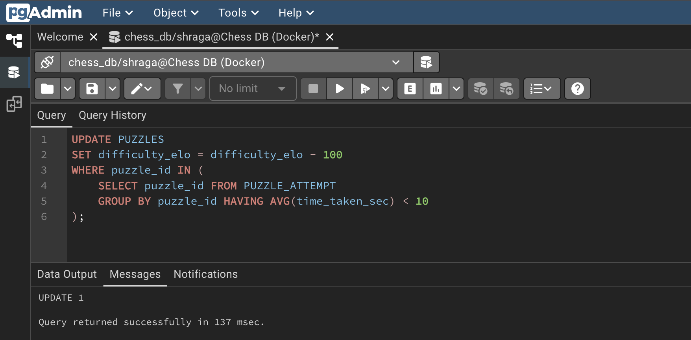

### Update 2 — Raise ELO for hard puzzles
Increase ELO by 100 for puzzles that took more than 60 seconds on average.
```sql
UPDATE PUZZLES SET difficulty_elo = difficulty_elo + 100
WHERE puzzle_id IN (SELECT puzzle_id FROM PUZZLE_ATTEMPT GROUP BY puzzle_id HAVING AVG(time_taken_sec) > 60);
```
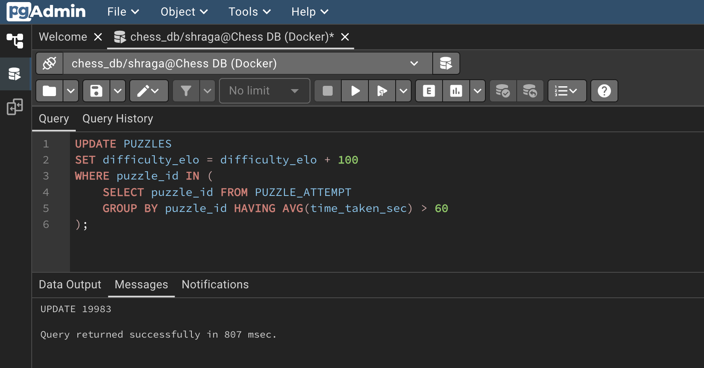

### Update 3 — Bonus XP for Sunday daily puzzles
Add 10 bonus XP to daily puzzles published on Sunday (DOW = 0).
```sql
UPDATE DAILY_PUZZLES SET bonus_xp = bonus_xp + 10
WHERE EXTRACT(DOW FROM puzzle_date) IN (0);
```
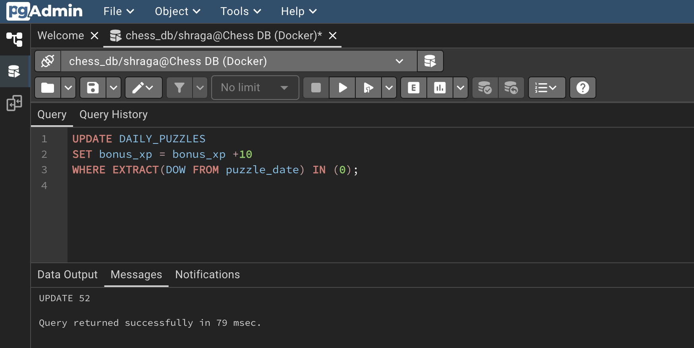

### Delete 1 — Old solve attempts
Delete puzzle-attempt records made before the year 2000.
```sql
DELETE FROM PUZZLE_ATTEMPT WHERE attempt_date < '2000-01-01';
```
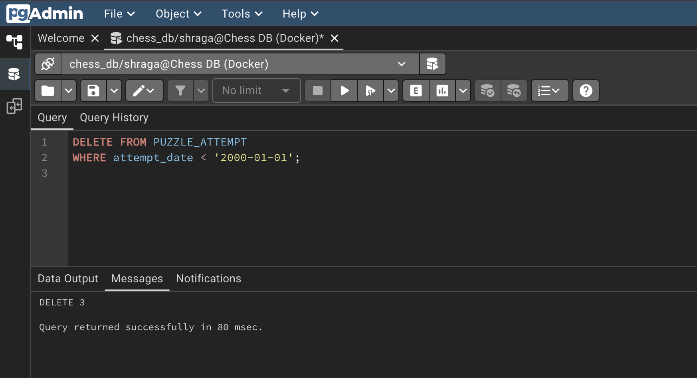

### Delete 2 — Old course progress
Delete chapter-progress records that started before the year 2000.
```sql
DELETE FROM CHAPTER_PROGRESS WHERE start_date < '2000-01-01';
```
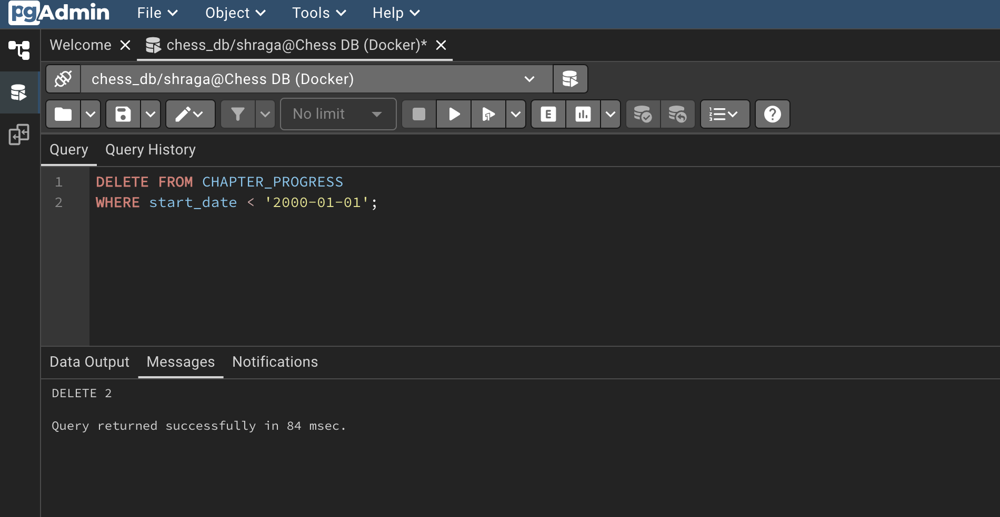

### Delete 3 — Empty courses
Delete courses that have no chapters linked to them.
```sql
DELETE FROM COURSES WHERE course_id NOT IN (SELECT course_id FROM CHAPTERS);
```
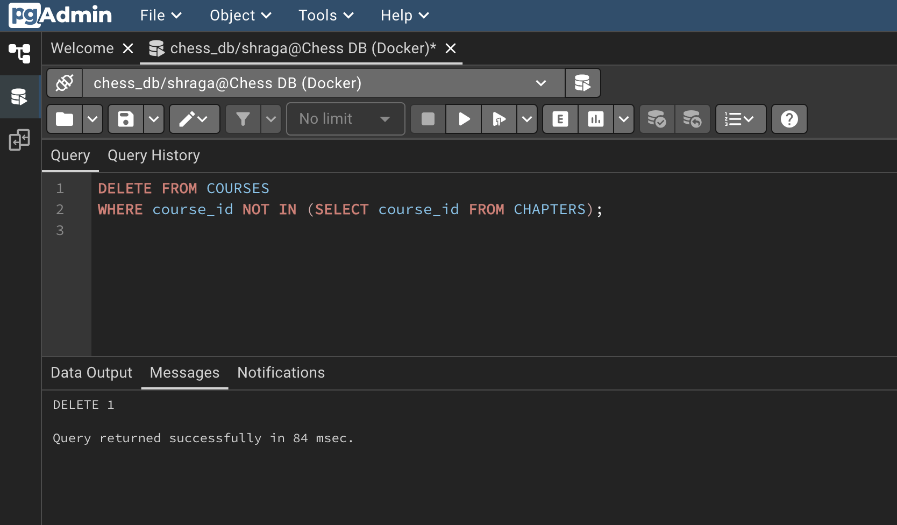

---

## Constraints

For each constraint: the `ALTER TABLE` that adds it (screenshot), then an attempt
to insert data that violates it and the resulting error (actual output).

> Source: `Constraints.sql`.

### Constraint 1 — Course-completion consistency
If a chapter is marked completed, `completion_date` must not be null, and vice versa.
```sql
ALTER TABLE CHAPTER_PROGRESS
ADD CONSTRAINT check_completion_consistency
CHECK ((is_completed = TRUE AND completion_date IS NOT NULL)
    OR (is_completed = FALSE AND completion_date IS NULL));

-- Violation attempt (completed but no completion date):
INSERT INTO CHAPTER_PROGRESS (user_id, chapter_id, is_completed, start_date, completion_date)
VALUES (1, 1, TRUE, '2023-01-01', NULL);
```

**Constraint added:** 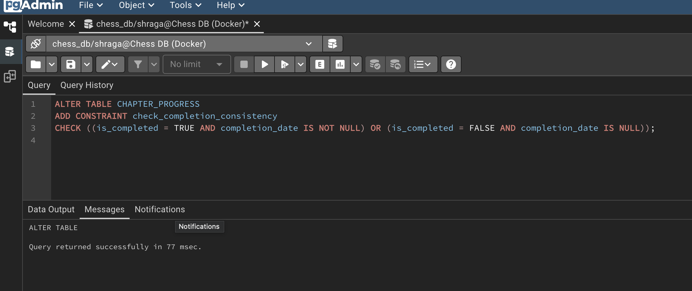

**Violation error (actual output):**
```text
ERROR:  new row for relation "chapter_progress" violates check constraint "check_completion_consistency"
DETAIL:  Failing row contains (8003, 1, 1, t, 2023-01-01, null).
```

### Constraint 2 — Date sanity
Completion date must be greater than or equal to the start date.
```sql
ALTER TABLE CHAPTER_PROGRESS
ADD CONSTRAINT check_dates_order CHECK (completion_date >= start_date);

-- Violation attempt (completion before start):
INSERT INTO CHAPTER_PROGRESS (user_id, chapter_id, is_completed, start_date, completion_date)
VALUES (1, 1, TRUE, '2023-05-01', '2023-01-01');
```

**Constraint added:** 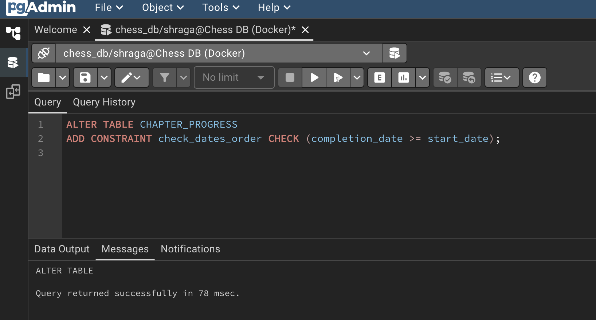

**Violation error (actual output):**
```text
ERROR:  new row for relation "chapter_progress" violates check constraint "check_dates_order"
DETAIL:  Failing row contains (8004, 1, 1, t, 2023-05-01, 2023-01-01).
```

### Constraint 3 — Unique chapter order
Two chapters in the same course cannot share the same ordinal number.
```sql
ALTER TABLE CHAPTERS
ADD CONSTRAINT unique_chapter_order_per_course UNIQUE (course_id, chapter_order);

-- Violation attempt (insert a (course_id, chapter_order) pair that already exists):
INSERT INTO CHAPTERS (title, content_text, chapter_order, course_id)
VALUES ('Duplicate order', 'x', 1, 1);
```

**Constraint added:** 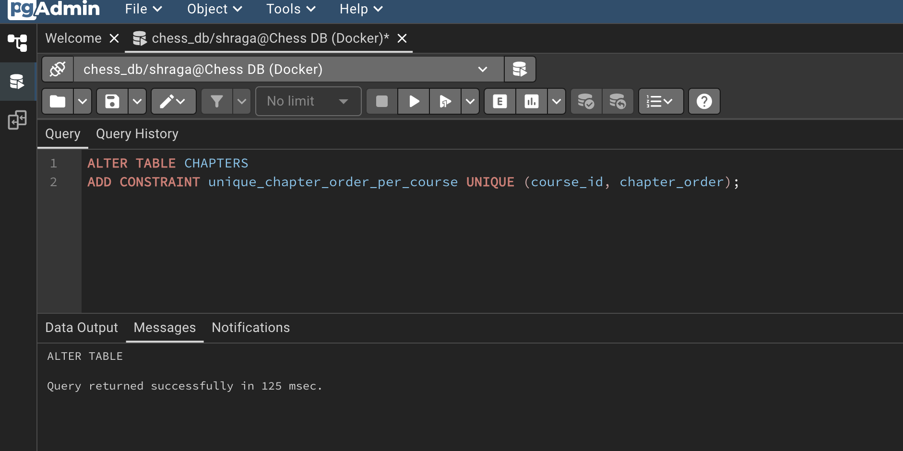

**Violation error (actual output):**
```text
ERROR:  duplicate key value violates unique constraint "unique_chapter_order_per_course"
DETAIL:  Key (course_id, chapter_order)=(1, 1) already exists.
```

---

## Transactions (Commit & Rollback)

> Source: `RollbackCommit.sql`.

### ROLLBACK demo
Insert a row inside a transaction, verify it exists, then `ROLLBACK` — the row disappears.
```sql
BEGIN;
INSERT INTO TAGS (tag_name, description) VALUES ('Test Tag', 'This should be rolled back');
SELECT * FROM TAGS WHERE tag_name = 'Test Tag';   -- row exists inside the transaction
ROLLBACK;
SELECT * FROM TAGS WHERE tag_name = 'Test Tag';   -- row is gone
```

| 1. Row exists inside the transaction | 2. ROLLBACK | 3. Row gone afterwards |
|---|---|---|
| 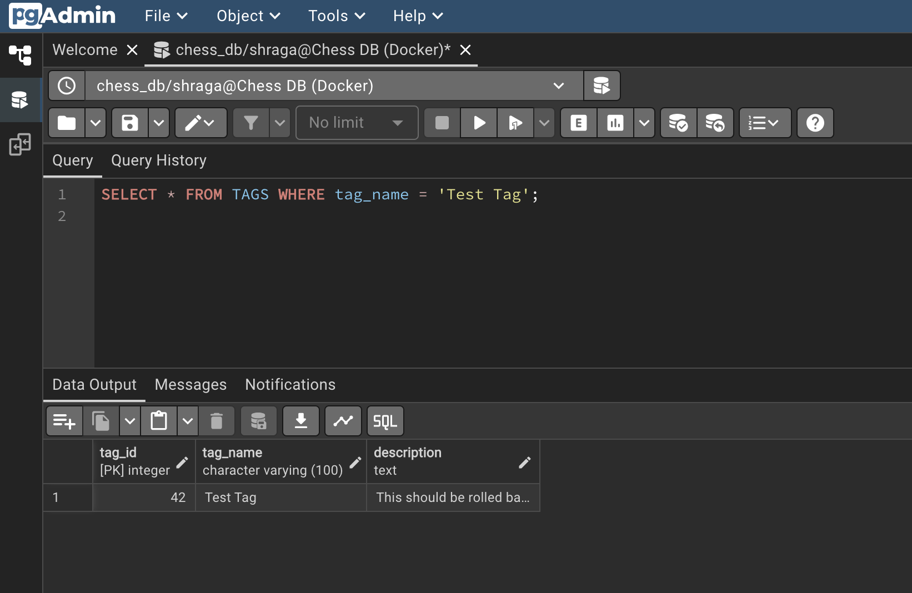 | 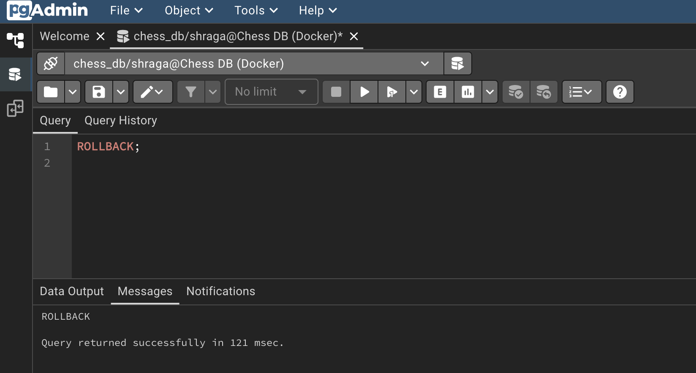 | 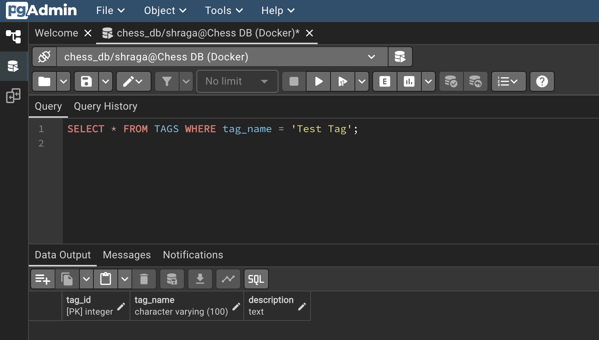 |

### COMMIT demo
Insert a new row and persist it permanently with `COMMIT`.
```sql
BEGIN;
INSERT INTO TAGS (tag_name, description) VALUES ('Commit Tag', 'This should be saved');
SELECT * FROM TAGS WHERE tag_name = 'Commit Tag'; -- row exists inside the transaction
COMMIT;
SELECT * FROM TAGS WHERE tag_name = 'Commit Tag'; -- row persists after commit
```

| 1. Insert | 2. Row in transaction | 3. COMMIT | 4. Row persists |
|---|---|---|---|
| 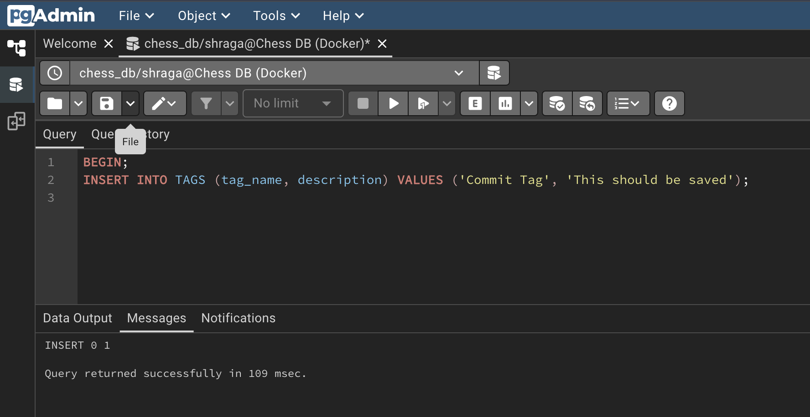 | 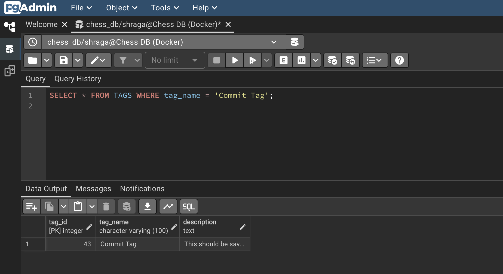 | 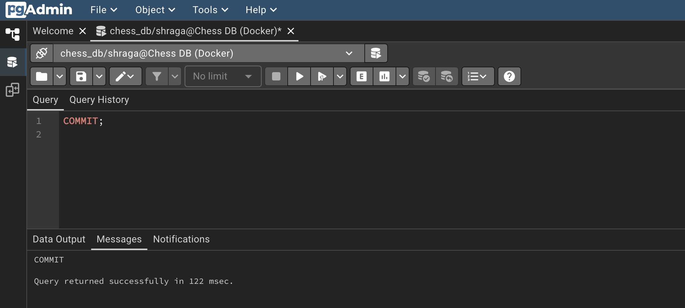 | 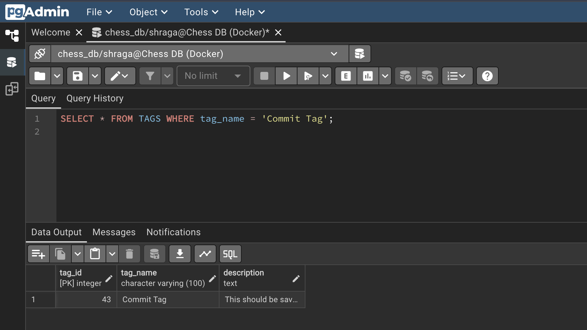 |

---

## Indexes

We added indexes on columns frequently used in filters (`WHERE`) and joins
(`JOIN`). Source: `Index.sql`.

```sql
CREATE INDEX idx_puzzles_difficulty   ON PUZZLES(difficulty_elo);
CREATE INDEX idx_puzzle_attempts_user ON PUZZLE_ATTEMPT(user_id);
CREATE INDEX idx_chapters_course      ON CHAPTERS(course_id);
```

### Index justifications

- **`idx_puzzles_difficulty` on `PUZZLES(difficulty_elo)`** — Accelerates queries
  that filter or sort by difficulty (e.g. "puzzles above the average ELO",
  Pair 9). Instead of a full sequential scan, the planner can use an Index Scan
  over the relevant range.

- **`idx_puzzle_attempts_user` on `PUZZLE_ATTEMPT(user_id)`** — `PUZZLE_ATTEMPT`
  is the largest table (~150,000 rows). Indexing `user_id` speeds up the join to
  `USERS` and the per-user grouping in the success-rate queries (Query 1),
  turning an expensive scan into an index lookup.

- **`idx_chapters_course` on `CHAPTERS(course_id)`** — Speeds up the foreign-key
  join between `COURSES` and `CHAPTERS` (Pair 7, deleting empty courses),
  avoiding a full scan of `CHAPTERS` for every course.

| idx_puzzles_difficulty | idx_puzzle_attempts_user | idx_chapters_course |
|---|---|---|
| 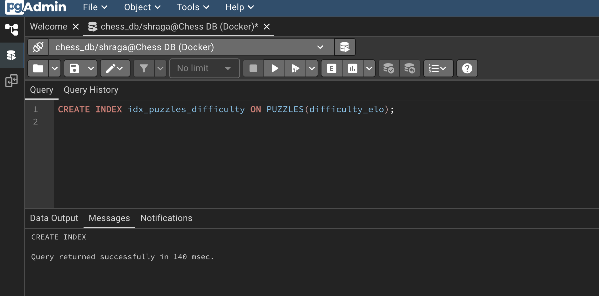 | 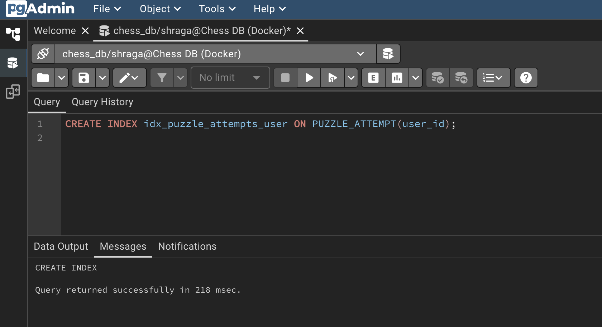 | 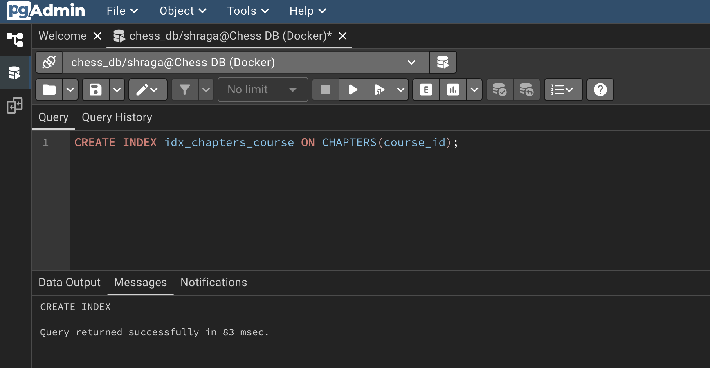 |

### Runtime before vs. after

We measured a selective lookup on `PUZZLE_ATTEMPT(user_id)` with `EXPLAIN ANALYZE`
before and after creating `idx_puzzle_attempts_user`. Before the index the
planner scanned all ~150,000 rows (**Sequential Scan**); after, it jumped
straight to the matching rows (**Index Scan**), reducing the runtime sharply.

```sql
-- BEFORE: drop the index (if present) and time the lookup
DROP INDEX IF EXISTS idx_puzzle_attempts_user;
EXPLAIN ANALYZE SELECT * FROM PUZZLE_ATTEMPT WHERE user_id = 1501;

-- AFTER: create the index and time the same lookup
CREATE INDEX idx_puzzle_attempts_user ON PUZZLE_ATTEMPT(user_id);
EXPLAIN ANALYZE SELECT * FROM PUZZLE_ATTEMPT WHERE user_id = 1501;
```

**Before the index — Sequential Scan, Execution Time ≈ 12.48 ms:**
```text
Seq Scan on puzzle_attempt  (cost=0.00..3029.73 rows=249 width=25)
                            (actual time=12.365..12.408 rows=25 loops=1)
  Filter: (user_id = 1501)
  Rows Removed by Filter: 150193
Planning Time: 3.052 ms
Execution Time: 12.483 ms
```

**After the index — Bitmap Index Scan, Execution Time ≈ 0.84 ms (~15× faster):**
```text
Bitmap Heap Scan on puzzle_attempt  (cost=6.22..611.03 rows=249 width=25)
                                    (actual time=0.821..0.823 rows=25 loops=1)
  Recheck Cond: (user_id = 1501)
  ->  Bitmap Index Scan on idx_puzzle_attempts_user
        (cost=0.00..6.16 rows=249 width=0) (actual time=0.812..0.812 rows=25 loops=1)
        Index Cond: (user_id = 1501)
Planning Time: 0.206 ms
Execution Time: 0.840 ms
```

The scan changed from reading all 150,193 rows to an index lookup, cutting the
execution time from ~12.5 ms to ~0.84 ms.
